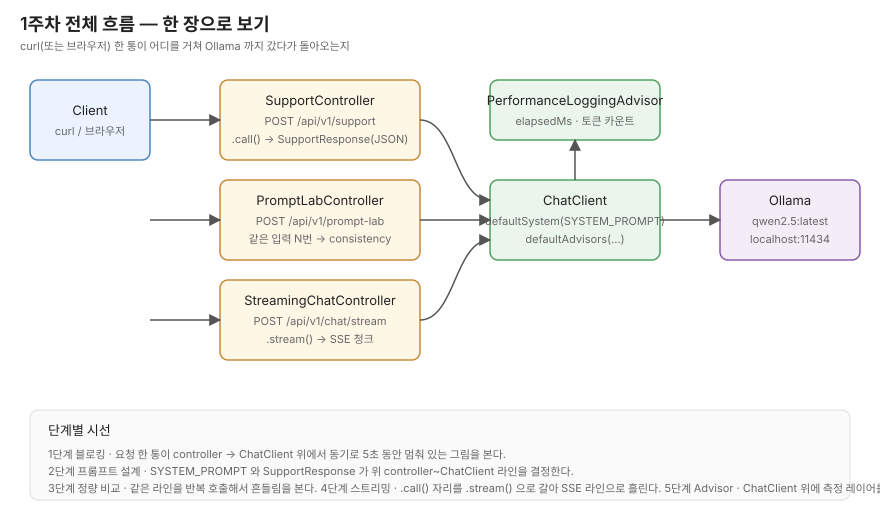

# 1주차 시나리오 복기 — 시작하기

다른 개발자가 1주차 코드를 처음 열었을 때, 어디서부터 어떻게 따라가면 되는지 손으로 잡혀지게 만든 가이드입니다.
회고 (`docs/1주차/00~07.md`) 가 "내가 그때 무슨 결정을 왜 했나" 라면, 이 폴더는 "다른 사람이 같은 길을 다시 걸을 때 어디를 보면 되나" 쪽입니다.

## 이 가이드의 사용법

다섯 단계로 끊어뒀어요. 한 단계마다 그림 한 장 + 본문 한 편 + 코드 위치 + 직접 두드려보는 `curl` 한 줄 이 한 묶음입니다.
앞 단계 결정이 다음 단계 코드에 그대로 들어가니까 순서대로 읽는 걸 권하고, 빠르게 보고 싶다면 그림만 훑으셔도 됩니다.

- [01. 1단계 — 블로킹과 LLM 호출의 특이성](01-단계1-블로킹.md)
- [02. 2단계 — 시스템 프롬프트와 구조화된 응답](02-단계2-프롬프트설계.md)
- [03. 3단계 — 같은 입력 N번 던져서 흔들림 보기](03-단계3-프롬프트정량비교.md)
- [04. 4단계 — `.call()` → `.stream()` 으로 SSE 흘리기](04-단계4-스트리밍.md)
- [05. 5단계 — Advisor 로 측정 레이어 끼우기](05-단계5-Advisor.md)
- [용어집](용어집.md)

각 단계 끝에는 "한 번 더 손으로 확인하고 가는 자리" 가 있어요. 회고 본문에서 "단정 못 한 채로 남겨둔 자리" 가 거기로 옮겨와 있습니다.

## 전체 흐름 한 장



지금 리포에 있는 세 컨트롤러가 같은 `ChatClient` 위에 서 있고, 그 `ChatClient` 가 `PerformanceLoggingAdvisor` 한 장을 끼운 채로 Ollama (`qwen2.5:latest`) 까지 요청을 흘려보내는 그림입니다.

- **`SupportController`** — 트리아지. 구조화된 JSON 한 덩어리를 받는 자리. 1·2·5단계가 여기 모입니다.
- **`PromptLabController`** — 같은 입력을 `repeat` 번 호출해서 흔들림을 보는 자리. 3단계.
- **`StreamingChatController`** — `.stream()` + SSE. 토큰을 청크로 흘리는 자리. 4단계.

1단계만 코드가 아니라 머리 안에서 정리하는 자리고, 2~5단계는 실제 코드 자리가 있습니다.

## 손 위에 두고 시작하는 명령어

```bash
ollama pull qwen2.5
./gradlew bootRun
```

`bootRun` 으로 8080 이 뜨면 세 엔드포인트가 열립니다. 각 단계 본문 끝에 그 단계용 `curl` 한 줄이 같이 있어요.
응답 시간이나 토큰 수가 궁금하면 `bootRun` 띄운 터미널을 같이 쳐다보세요. `PerformanceLoggingAdvisor` 가 한 줄씩 박아줍니다 (5단계 자리).

테스트로 회귀를 잡으려면:

```bash
./gradlew test --rerun-tasks
```

1주차 시점에 13 케이스가 같은 batch 에서 `failures="0" errors="0"` 으로 통과했고, 컨트롤러 경계의 `*ValidationTest` 7 케이스를 합치면 26 케이스가 됩니다.
이 가이드 따라가면서 코드가 부서지는 것 같으면 이 명령어부터 한 번 돌려보세요. 어느 케이스가 빨갛게 떨어지느냐가 "내가 어디서 흔들었나" 를 가장 빠르게 알려주는 신호입니다.

## 학습 환경 (회고에서 두드린 그 환경)

- Ollama `qwen2.5:latest` (4.7GB)
- `application.yml` : `temperature: 0.3`, `base-url: http://localhost:11434`
- `./gradlew bootRun` → 포트 8080
- raw 응답은 `/tmp/baedal-실측/` 에 저장한 흔적이 있고 (커밋 대상은 아님), 정리된 raw 노트는 [`docs/1주차/실측-raw/`](../실측-raw/) 에 같이 들어있습니다.

`temperature: 0.3` 이라 같은 입력이라도 응답이 살짝 흔들립니다. 가이드 본문에 적힌 숫자랑 자기 환경 숫자가 한두 자리 다르더라도 정상 범위라고 보고 가세요 — 흔들림 자체를 보는 게 3단계 핵심입니다.

## 톤에 대한 미리 안내

이 가이드는 "이렇게 하면 됩니다" 보다는 "여기서 이 결정을 왜 했고, 어디까지가 데이터로 확인됐는지" 쪽에 무게를 둡니다.
회고에서 한 번 손본 그대로예요 — 단정 톤으로 적었다가 실측에서 흔들렸던 부분이 꽤 있었거든요. 그래서 본문에 가끔 "이건 직접 두드려본 다음에 다시 정리해야 할 자리" 같은 줄이 섞입니다. 그 자리가 다음에 손볼 영역이에요.

읽다가 막히면 가장 가까운 회고 (`docs/1주차/0X.*.md`) 와 그 끝의 "실측해보고 적어두는 부록" 을 같이 펴 보세요. 가이드는 회고를 가로지른 길잡이고, 회고는 그때 그때의 의심까지 다 적힌 원본입니다.
