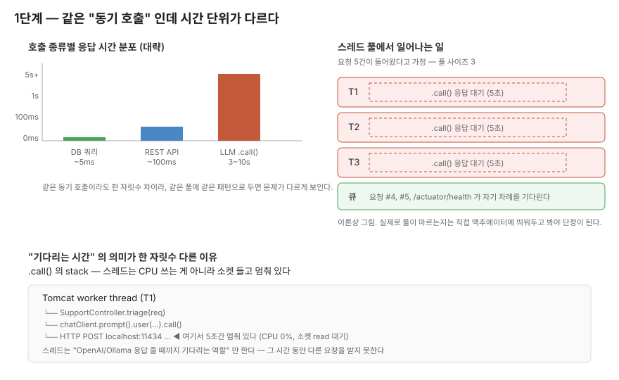

# 1단계 — 블로킹과 LLM 호출의 특이성

> 이 단계는 코드 자리가 아니에요. `.call()` 한 줄 위에서 한 박자 멈추고 가는 자리입니다.

## 이 단계에서 마주치는 질문

`SupportController` 에 `.call()` 한 줄을 얹어두면 동작은 합니다. 외부 API 한 번 호출하는 거랑 모양도 비슷해요.
그런데 이 한 줄이 평소 다루던 외부 호출이랑 정말 같은 패턴으로 봐도 되는 건지, 단계 1 은 그걸 손에 잡힐 때까지 들여다보는 자리입니다.

## 호출 시간 단위가 한 자릿수 다르다

평소 백엔드에서 외부 호출은 길어도 수백 ms, 좀 느려도 1~2초 안에 끊긴다고 두고 살았습니다.
그 전제 위에서 Tomcat 스레드 풀 크기, 타임아웃, 서킷 브레이커 결정이 깔려 있었어요.

LLM 호출은 같은 동기 외부 호출인데 시간 단위가 한 자릿수 (또는 그 이상) 다릅니다.
체감 5초, 길면 10초 넘게 걸리는 호출을 평소 패턴 그대로 다뤄도 되는가 — 이 질문이 풀리지 않으면 그 위에 얹는 모든 결정이 흔들립니다.

## 블로킹이라는 단어를 다시 한 번 짚는다

"동기 호출 = 블로킹" 정도로 받아들이고 살았다면, 이번 한 번은 좀 더 천천히 봐 두는 게 도움이 됩니다.

`.call()` 응답을 기다리는 동안 그 스레드는 CPU 를 쓰는 게 아니에요. 소켓 들고 멈춰 있습니다.
계산도 디스크 I/O 도 아닌, "Ollama 서버가 응답 줄 때까지 기다리는 역할" 만 5초 동안 합니다.

DB 쿼리에서는 이 "기다리는 시간" 이 짧으니까 별로 안 보였어요. 스레드 하나가 5ms 멈춰 있는 건 처리량에 큰 영향이 없으니까요.
LLM 호출에서는 그 멈춰 있는 시간이 5초, 10초 단위로 늘어납니다. 머리로 계산하면 동시 요청 200건이 한꺼번에 들어왔을 때 Tomcat 기본 풀 200 이 통째로 "Ollama 응답 대기" 한 가지 일에 잡힐 수도 있어요.

이건 이론 추정이에요. 진짜 그 그림이 나오는지는 액추에이터 메트릭 띄워두고 직접 부하를 줘봐야 단정이 됩니다.
Tomcat 에는 acceptor 큐도 있고 환경마다 풀 사이즈도 다르고 실제 트래픽이 항상 200건 동시 폭주랑 같지도 않으니까, "위험 가능성이 있다" 정도로 두고 다음 단계로 가세요.

## 서버 측면과 사용자 측면이 갈라진다

여기서 한 번 더 멈추면 좋은 자리가 사용자 체감입니다.

`.call()` 패턴에서 사용자는 요청 보낸 다음 응답 다 만들어질 때까지 흰 화면을 봅니다.
LLM 이 토큰을 차곡차곡 만들고 있는 그 5~10초 동안, 사용자 입장에서는 "서버가 죽었나" 와 잘 구분이 안 가요.
ChatGPT 화면이 글자 한 자씩 떨어지는 건 UI 트릭이 아니라 "백엔드가 토큰 단위로 흘려보내고 있다" 라는 신호인데, 이건 4단계에서 다시 만납니다.

블로킹 문제는 사실 두 결입니다.

- **서버 자원** — 스레드 풀이 LLM 응답 대기로 잡히는 문제 (이론 추정, 측정 필요)
- **사용자 체감** — 첫 토큰까지 침묵이 너무 긴 문제 (curl -N 으로 한 번에 확인됨, 4단계)

둘은 원인은 같은데 풀어야 할 지표가 다릅니다. 이 갈래를 손에 들고 2~4단계로 들어가야 어디서 어느 결을 풀고 있는지가 헷갈리지 않아요.

## .stream() 보면서 한 번 잘못 들어가기 쉬운 자리

4단계에서 `.call()` 자리를 `.stream()` 으로 바꾸고 반환 타입을 `Flux<String>` 으로 가져갑니다.
이걸 처음 보면 "WebFlux 로 컨트롤러를 통째로 갈아엎어야 되나" 하는 생각이 한 번 들 수 있어요. `Flux` = Reactor = WebFlux 라는 묶음이 머릿속에 있으면 자연스러운 추정이긴 합니다.

이건 한 번 검증해두면 좋은 자리예요. Spring MVC (서블릿) 위에서도 컨트롤러가 `Flux<String>` 을 그대로 반환할 수 있습니다.
MVC 안에 `ReactiveTypeHandler` 가 끼어서 처리해주고, 서블릿 3.0 의 async 처리 위에서 토큰을 SSE 로 흘려보내는 식이에요.

즉 "WebFlux 로 갈아엎는다" 가 아니라 "응답을 점진적으로 흘려보내는 모드를 하나 더 쓴다" 에 가깝습니다.
4단계 코드를 봤을 때 "어? 컨트롤러 다른 데는 그대로네?" 가 헷갈리지 않으려면 이 자리를 한 번 짚고 가는 게 좋아요.

## 그래도 .call() 을 무조건 못 쓰는 건 아닙니다

`.call()` 이 항상 잘못된 선택은 아닙니다.
`SupportController` 처럼 구조화된 JSON 한 덩어리를 받는 케이스는 부분 JSON 청크를 클라이언트가 파싱하지 못하니까 `.stream()` 이 오히려 어색해요.
짧고 구조화된 응답은 `.call()`, 길고 자연어 응답은 `.stream()` — 일단 이 가설을 들고 들어가서 양쪽을 둘 다 두드려보는 흐름이 1주차 코드 안에 그대로 들어가 있습니다.

## 코드 자리 (1단계는 머리만 정리)

이 단계에 손볼 코드는 없어요. 다만 다음 단계로 넘어가기 전에 한 번 펴 보면 좋은 자리가 두 곳 있습니다.

- `src/main/java/com/baedal/support/SupportController.java` — `.call()` 한 줄이 박힌 곳. 다음 단계에서 이 한 줄에 SYSTEM_PROMPT 와 `.entity()` 가 따라붙습니다.
- `src/main/java/com/baedal/support/StreamingChatController.java` — `.stream()` 한 줄이 박힌 곳. 4단계까지 가서 다시 옵니다.

## 한 번 더 손으로 확인하고 가는 자리

이 단계의 결정이 데이터로 확인된 부분과 추정으로 남은 부분을 함께 적어둡니다.

데이터로 확인된 자리는 [`docs/1주차/실측-raw/stream-curl-N.md`](../실측-raw/stream-curl-N.md) 에 있어요.
TTFT 가 짧고 마지막 토큰까지 합치면 4.58s 였다는 그림이 직접 두드린 raw 입니다. 사용자 체감 결의 가설이 데이터로 잡힌 자리예요.

추정으로 남은 자리는 두 곳입니다.

- 스레드 풀이 진짜 마르는가 — 아직 액추에이터 메트릭으로 직접 확인 안 됨. 이론상 위험으로만 둔다.
- 클라이언트가 중간에 끊었을 때 Ollama 호출이 어디서 끊기는가 — `Flux` cancel 신호가 LLM 호출까지 전파되는지 미확인. 4단계 회고에 미해결로 적어둔 그 자리.

이 두 줄을 들고 2단계로 넘어가세요.

다음 단계 → [02. 2단계 — 시스템 프롬프트와 구조화된 응답](02-단계2-프롬프트설계.md)
