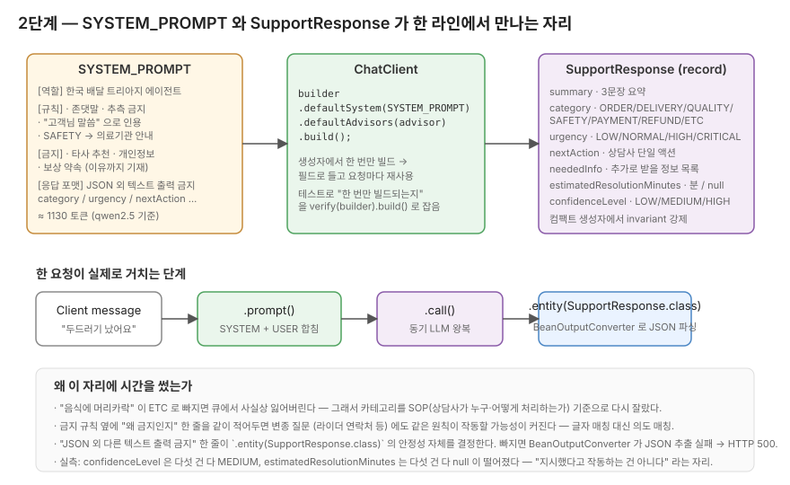

# 2단계 — 시스템 프롬프트와 구조화된 응답

> `BaedalPrompt.SYSTEM_PROMPT` 뼈대를 두고 시작하지만, 한 번쯤 직접 손으로 풀어쓰면서 가는 자리입니다.

## 이 단계에서 마주치는 질문

스타터에 카테고리가 다섯 개 (`ORDER / DELIVERY / REFUND / PAYMENT / ETC`) 박혀 있어요.
이걸 그대로 가져가면 "음식에 머리카락 나왔어요" 도 "어제 시킨 거 먹고 두드러기" 도 다 `ETC` 로 떨어집니다. 큐에서 사실상 잃어버리는 카테고리예요.

이 단계의 진짜 질문은 "프롬프트를 어떻게 써야 LLM 이 잘 따라오나" 가 아니라 "이 응답을 받는 상담사가 어떻게 분류돼 있어야 일이 풀리나" 쪽입니다.
LLM 입장의 분류 편의가 아니라 SOP (상담사가 누구, 어떻게 처리하는가) 기준으로 다시 잘라야 카테고리 하나하나가 작동합니다.

## 한 라인에서 만나는 세 조각



세 조각이 한 라인 위에 있습니다.

- 왼쪽 — **`SYSTEM_PROMPT`** (`BaedalPrompt.java`) : 모델에게 줄 역할/규칙/금지/응답 포맷.
- 가운데 — **`ChatClient`** : 빌드 시점에 `defaultSystem(...)` 으로 위 프롬프트를 매 호출 앞에 깔아주는 자리.
- 오른쪽 — **`SupportResponse`** (record) : 모델 응답을 받을 자바 타입. `.entity(SupportResponse.class)` 가 JSON 을 이 모양으로 변환.

이 세 조각이 짝이 맞아야 합니다. 시스템 프롬프트가 "JSON 외 다른 텍스트 출력 금지" 라고 적혀 있어야 `.entity()` 가 안 깨지고, `SupportResponse` 의 필드명이 시스템 프롬프트의 응답 포맷 항목 이름과 일치해야 자바 객체로 깨끗하게 들어옵니다.

## 카테고리는 SOP 기준으로 다시 자른다

스타터 카테고리 다섯 개 → 일곱 개로 늘어났어요. 그 이유:

- `QUALITY` (음식 품질/맛/양/이물질) 와 `SAFETY` (식중독/알레르기) 를 분리. 같은 "음식에 문제 있어요" 도 매장 컴플레인 트랙이냐 의료기관 안내 트랙이냐가 다르니까요.
- `PAYMENT` 와 `REFUND` 도 분리. 결제 오류는 PG 로그를 봐야 하고 환불은 사장님 합의가 필요한데, 처리하는 사람이 다릅니다.

이게 정답이라는 단정은 아닙니다. 실측에서 머리카락 이물질이 `QUALITY` 가 아닌 `SAFETY` 쪽으로 더 자주 떨어졌어요 (3단계 부록). SOP 분할과 모델의 분류 기준이 항상 일치하진 않습니다.
일곱 개로 두고 분류 로그를 보면서 손볼 영역으로 남겨뒀어요.

## 금지 규칙 옆에 "왜" 를 같이 적는다

뼈대의 금지 3개 (타사 추천 / 개인정보 노출 / 보상 약속) 옆에 한 줄씩 사유를 같이 적어뒀어요.

```text
- 매장 사장님, 라이더의 개인정보(연락처, 실명, 주소)는 어떤 경우에도 노출하지 않습니다.
  (이유: 개인정보보호법 위반 회피, 보복 분쟁 차단)
```

이게 글자가 길어져서 토큰 비용으로 보이긴 합니다. 그런데 LLM 동작 관점에서 보면 글자 그대로 매칭보다 "이 규칙의 의도" 를 따라가는 쪽이 좀 더 안정적인 경향이 있어요.
"매장 사장님 연락처 알려주세요" 와 "라이더 연락처 알려주세요" 는 둘 다 개인정보 노출 금지에 걸려야 하는데, 글자만 적어두면 변종 케이스가 새 가능성을 봐버릴 수도 있습니다. 사유까지 적어두면 그 결을 같이 잡습니다.

이건 그동안 모델 튜닝하면서 손에 익은 직관에 가깝습니다. 정량 비교는 3단계 자리예요.

## SAFETY 가드레일 한 줄

규칙 마지막에 이 한 줄이 들어갑니다.

```text
- 식중독 의심, 알레르기 반응, 이물질 섭취 같은 식품 안전 호소는
  긴급으로 분류하고 의료기관 방문을 권유합니다. 직접 진단하지 않습니다.
```

실측에서 이 한 줄이 그대로 작동한 자리예요. "어제 시킨 거 먹고 두드러기 났어요" 한 줄에 `category=SAFETY`, `urgency=CRITICAL`, `nextAction = "의료기관 방문 권유"` 가 떨어집니다.
시스템 프롬프트 손본 보람이 가장 분명하게 보인 자리.

## confidenceLevel — 위험 신호를 표면화하려는 시도

`SupportResponse` 에 `confidenceLevel` (LOW/MEDIUM/HIGH) 을 추가했는데, 2단계에서 가장 망설인 결정입니다.

상담사가 받는 응답에 "이 분류가 사실 기반인지 추측인지" 가 안 보이면, 바쁜 상담사가 그대로 쓰기 쉽습니다. 그게 식품 안전 사고였을 때를 생각하면 좀 무서운 그림이에요. 그래서 모델이 자기 답이 추측이라는 사실을 표면화하도록 강제하는 필드로 추가했습니다.

근데 실측에선 다섯 건 다 MEDIUM 으로만 떨어졌어요. 주문번호가 명시된 ORDER 도 MEDIUM, 단서 거의 없는 PAYMENT 도 MEDIUM. 시스템 프롬프트의 "근거 부족하면 LOW" 지시가 사실상 안 먹혔습니다.
모델이 자기 확신도를 가운데 값에 던지는 습관이 있는 게 아닐까 싶은데, 다섯 건만 본 거라 단정은 못 합니다. 의심 짙어진 채로 다음 라운드로 넘어간 자리.

복기하는 입장에서는 이 필드를 그대로 두고 "지시했다고 작동하는 건 아니다" 라는 자리를 같이 보고 가는 게 핵심이에요.

## 컨트롤러 배선에서 잡고 가야 할 부분

`SupportController` 를 처음 짜면 매 요청마다 `builder.defaultSystem(...).build()` 가 도는 모양으로 짜기 쉽습니다. 그러면 요청마다 `ChatClient` 빈을 새로 만드는 셈이에요.

생성자에서 한 번만 빌드해두고 필드로 들고 있는 패턴으로 갑니다.

```java
public SupportController(ChatClient.Builder builder, PerformanceLoggingAdvisor advisor) {
    this.chatClient = builder
            .defaultSystem(BaedalPrompt.SYSTEM_PROMPT)
            .defaultAdvisors(advisor)
            .build();
}
```

이게 진짜 한 번만 빌드되는지가 신경 쓰여서 `SupportControllerTest` 에 검증 케이스를 일부러 하나 넣어뒀어요 (`triage_doesNotBuildChatClientPerRequest`). 같은 컨트롤러 인스턴스로 두 번 호출해도 `builder.build()` 가 1회만 도는지 verify 로 잡습니다.

5단계의 `PromptLabController` 는 요청마다 system prompt 가 바뀌니까 같은 패턴이 안 됩니다. 그건 그 단계에서 다시 봅니다.

## 코드 자리

- `src/main/java/com/baedal/support/BaedalPrompt.java` — 시스템 프롬프트 본문
- `src/main/java/com/baedal/support/SupportResponse.java` — record 정의, 컴팩트 생성자에서 invariant 강제
- `src/main/java/com/baedal/support/SupportController.java` — 생성자 빌드 패턴, `.call().entity()`
- `src/test/java/com/baedal/support/SupportControllerTest.java` — 빌드 1회 가드 + `triage_appliesSystemPromptAndReturnsStructuredResponse`
- `src/test/java/com/baedal/support/SupportControllerValidationTest.java` — 컨트롤러 경계의 Bean Validation 가드

## 직접 두드려보기

`bootRun` 띄운 다음에:

```bash
curl -X POST http://localhost:8080/api/v1/support \
  -H "Content-Type: application/json" \
  -d '{"message":"어제 시킨 거 먹고 두드러기가 났어요. 새우 알레르기인지 모르겠어요."}'
```

기대하는 응답 모양 :

- `category` → `SAFETY`
- `urgency` → `HIGH` 또는 `CRITICAL`
- `nextAction` 에 "의료기관 방문" 비슷한 문장이 들어감
- `confidenceLevel` 은 자기 환경에서는 `MEDIUM` 으로 떨어질 가능성이 큼 (실측에서 그랬다는 자리)

같은 입력을 2~3번 더 두드려보세요. `temperature: 0.3` 이라 같은 입력에도 답이 살짝 흔들립니다. 이게 3단계에서 본격적으로 보는 그림이에요.

raw 데이터는 [`docs/1주차/실측-raw/support-5건.md`](../실측-raw/support-5건.md) 에 그대로 있습니다.

## 한 번 더 손으로 확인하고 가는 자리

데이터로 작동이 확인된 자리:

- ENRICHED 프롬프트의 "JSON 외 텍스트 금지" 한 줄이 `.entity()` 안정성을 결정함 — SIMPLE 프롬프트는 같은 입력에 HTTP 500 으로 깨졌어요 (3단계 부록).
- SAFETY 가드레일이 의료기관 안내를 자동으로 붙여줌.

추정으로 남은 자리:

- `confidenceLevel` 이 실제 추측 케이스에서 LOW 를 솔직하게 뱉는가 — 다섯 건 다 MEDIUM, 미해결.
- `estimatedResolutionMinutes` 가 진짜 값을 뱉는가 — 다섯 건 다 null, 미해결. 카테고리별 typical resolution time 을 시스템 프롬프트에 같이 박거나 few-shot 예시를 보여줘야 발화할 가능성이 있다는 가설은 새로 생겼어요.

이 둘이 모호한 분류 케이스에서 어떻게 갈리는지가 3단계의 시작점입니다.

이전 단계 ← [01. 1단계 — 블로킹](01-단계1-블로킹.md) ・ 다음 단계 → [03. 3단계 — 프롬프트 정량 비교](03-단계3-프롬프트정량비교.md)
