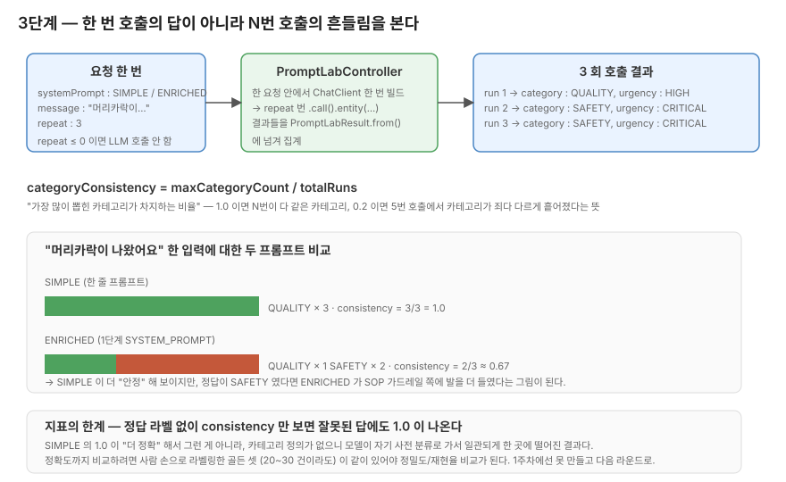

# 3단계 — 같은 입력 N번 던져서 흔들림 보기

> 2단계가 끝나도 손에 안 잡히는 게 있었어요. "프롬프트 손본 게 진짜 효과가 있는 건가" 를 무엇으로 확인할까.

## 이 단계에서 마주치는 질문

2단계 끝에 두 개의 미해결이 있었습니다. `confidenceLevel` 이 추측 케이스에서 LOW 를 뱉는지, 카테고리 일곱 개 분할이 적절한지.
둘 다 "한 번 호출해서 답이 맞으면 OK" 로는 검증이 안 돼요.

같은 입력을 LLM 에 N번 던졌을 때 카테고리가 N번 다 같게 떨어지는가, 아니면 흔들리는가 — 거기부터 봐야 어디까지 신뢰할지 정해집니다.
`application.yml` 에 `temperature: 0.3` 으로 잡혀 있어서 완전 결정론은 아니고, 같은 입력에 응답이 어느 정도 흔들리는 게 정상이에요.

3단계의 본은 "정답을 맞췄는가" 가 아니라 **"흔들림이 얼마나 큰가"** 를 먼저 보는 자리입니다.

## categoryConsistency 가 측정하는 것



`PromptLabResult.from()` 에 박힌 계산식.

```text
categoryConsistency = maxCategoryCount / totalRuns
```

가장 많이 뽑힌 카테고리가 차지하는 비율입니다.

- `1.0` — N번이 다 같은 카테고리
- `0.2` — 5번 호출에서 카테고리가 죄다 다르게 흩어졌다는 뜻

이 지표가 보는 건 **안정성** 입니다. 정답이 아니에요.
모델이 어떤 입력에 다섯 번 다 자신 있게 `ETC` 로 분류해도 consistency 는 1.0 으로 떨어집니다. 사실은 `SAFETY` 였어야 할 입력이라도요.

그래서 이 한 지표만 보고 "프롬프트가 좋아졌다" 라는 판정은 못 합니다. 정답까지 보려면 사람이 손으로 라벨링한 골든 셋이 같이 있어야 정밀도/재현율 같은 진짜 분류 지표가 나옵니다. 1주차에선 거기까진 못 갔어요.

이 한계를 머리에 두고 숫자를 봐야 합니다. 다음 단락이 그 한계가 실측에서 그대로 노출된 자리예요.

## 머리카락 케이스가 알려준 한계

같은 입력 — "음식에 머리카락이 나왔어요. 너무 화가 납니다."
두 프롬프트로 `repeat: 3` 호출:

- **SIMPLE** ("당신은 친절한 한국 배달 고객 상담사입니다. 친절하게 답하세요." 한 줄)
  → 세 번 다 `QUALITY` + `HIGH`. consistency = `1.0`
- **ENRICHED** (2단계의 `SYSTEM_PROMPT` 전체)
  → `QUALITY` × 1, `SAFETY` × 2 (모두 `CRITICAL`). consistency = `0.67`

숫자만 보면 SIMPLE 이 더 안정적이에요. 근데 SIMPLE 이 더 정확해서 그런 게 아닙니다.
SIMPLE 프롬프트엔 카테고리 정의 자체가 없어요. 모델이 자기 사전 분류로 가서 일관되게 한 곳에 떨어졌을 뿐입니다.

정답 라벨 없이 consistency 만 보면 "잘못된 정답에 일관적인 경우" 와 "진짜 정답을 안정적으로 뱉는 경우" 가 구분이 안 됩니다. 머리카락 SIMPLE 케이스가 그 한계를 그대로 보여주는 자리예요.

게다가 회고에선 "이물질 = QUALITY" 로 단정했는데, 모델은 ENRICHED 프롬프트에서 머리카락 이물질을 SAFETY 쪽에 더 자주 분류했어요. 회고의 SOP 분할이 모델 분류 기준과 항상 일치하진 않는다는 게 데이터로 잡힌 자리이기도 합니다.

## 빠지면 깨지는 자리 — JSON 강제 한 줄

같은 비교에서 두 번째 메시지 ("어제 시킨 거 먹고 토했어요. 새우 알레르기인 거 같아요.") 의 SIMPLE 쪽이 HTTP 500 으로 깨졌어요.

모델이 JSON 으로 답할 의무가 없으니까 자유롭게 자연어로 답했고, `.entity(SupportResponse.class)` 의 `BeanOutputConverter` 가 JSON 추출에 실패한 거예요.
2단계 `SYSTEM_PROMPT` 의 "JSON 외 다른 텍스트는 출력하지 않습니다" 한 줄이 그냥 형식 지시가 아니라 엔드포인트 안정성을 결정하는 가드라는 게 데이터로 잡힌 자리입니다.

ENRICHED 쪽은 같은 입력을 세 번 다 `SAFETY` 로 분류했고, `urgency` 만 HIGH 두 번 CRITICAL 한 번으로 갈렸어요. 이 정도는 `temperature: 0.3` 의 자연스러운 흔들림으로 봐도 됩니다.

## 단순 입력에선 차이가 없다

세 번째 메시지 ("주문 취소하고 싶어요.") 는 SIMPLE / ENRICHED 둘 다 `ORDER` + `NORMAL` 로 똑같이 떨어졌어요.

입력에 단서가 너무 명확하면 프롬프트 보강의 효과가 0 입니다.
ENRICHED 가 모든 입력에서 우월한 게 아니라, **모호 입력** 에서만 차이가 보입니다. 이걸 머리에 두고 비교 실험을 설계하지 않으면 "차이가 안 보이네" 라는 잘못된 결론에 가기 쉬워요.

## 구현 결정 몇 가지

엔드포인트는 `POST /api/v1/prompt-lab` 으로, `systemPrompt` 와 `message`, `repeat` 을 받습니다.
요청마다 system prompt 가 바뀌니까 2단계 `SupportController` 처럼 생성자에서 한 번만 빌드하는 패턴은 못 써요. 그래도 한 요청 안에서는 `ChatClient.Builder.build()` 가 한 번만 돌고, 그 `ChatClient` 가 `repeat` 번 재사용되도록 묶었습니다.

`repeat <= 0` 이면 LLM 을 부르지 않고 빈 결과를 돌려줍니다. 의도가 모호한 입력으로 모델에 부담을 주지 않으려는 가드예요. 학습 환경이라 비용은 작지만 운영을 가정하면 처음부터 들이는 게 손에 익습니다.

또 한 가지 — 1주차 후반에 컨트롤러 경계의 Bean Validation 을 들였어요. `repeat` 의 최대값은 `PromptLabController` 에서 막아두고, 검증 실패는 LLM 호출 전에 400 으로 끊습니다. 그 가드의 상한이 어디 박혀 있는지는 `PromptLabControllerValidationTest` 를 보면 됩니다.

## 코드 자리

- `src/main/java/com/baedal/support/PromptLabController.java` — 엔드포인트, `ChatClient` 빌드 (요청별)
- `src/main/java/com/baedal/support/PromptLabResult.java` — `from(...)` 안의 consistency 계산
- `src/test/java/com/baedal/support/PromptLabControllerTest.java` — 4 케이스 (빌드 1회 / consistency 식 / repeat=0 / 음수)
- `src/test/java/com/baedal/support/PromptLabControllerValidationTest.java` — `@Valid` 가드 (repeat 상한 포함)

## 직접 두드려보기

```bash
curl -X POST http://localhost:8080/api/v1/prompt-lab \
  -H "Content-Type: application/json" \
  -d '{
        "systemPrompt": "당신은 친절한 한국 배달 고객 상담사입니다. 친절하게 답하세요.",
        "message": "음식에 머리카락이 나왔어요. 너무 화가 납니다.",
        "repeat": 3
      }'
```

응답에 `categoryConsistency` 가 떨어집니다. SIMPLE 프롬프트로 위 입력을 두드리면 1.0 에 가깝게 나올 가능성이 큰데, 이 1.0 의 의미를 잘못 읽지 않도록 머리카락 케이스의 그림을 같이 두고 보세요.

같은 입력에 ENRICHED 프롬프트 (2단계 `BaedalPrompt.SYSTEM_PROMPT` 전체) 를 박아 비교해보면 0.67 ~ 1.0 사이에서 흔들리는 그림을 직접 볼 수 있습니다.

raw 데이터는 [`docs/1주차/실측-raw/promptlab-SIMPLE-vs-ENRICHED.md`](../실측-raw/promptlab-SIMPLE-vs-ENRICHED.md) 에 같이 있어요.

## 한 번 더 손으로 확인하고 가는 자리

데이터로 확인된 자리:

- ENRICHED 의 "JSON 외 텍스트 금지" 한 줄이 빠지면 `.entity()` 가 깨진다 (SIMPLE 쪽 HTTP 500).
- 모호 입력에선 ENRICHED 가 SAFETY 가드레일 쪽으로 분류를 끌어간다.
- 단순 입력에선 프롬프트 보강 효과가 0 이다.
- consistency 1.0 이 항상 "정확함" 을 뜻하지는 않는다.

추정으로 남은 자리:

- 정답 라벨 셋 (사람이 직접 라벨링한 골든 셋) 없이는 정밀도 비교가 안 된다 — 다음 라운드 영역.
- `temperature` 를 0.0 으로 떨어뜨리면 consistency 가 1.0 에 더 붙을 가능성이 크지만, 그건 프롬프트 효과가 아니라 샘플링이 좁아진 결과 — 비교 실험에선 temperature 를 고정하고 SYSTEM_PROMPT 만 바꾸는 게 맞을 것 같습니다.

이전 단계 ← [02. 2단계 — 프롬프트 설계](02-단계2-프롬프트설계.md) ・ 다음 단계 → [04. 4단계 — 스트리밍](04-단계4-스트리밍.md)
