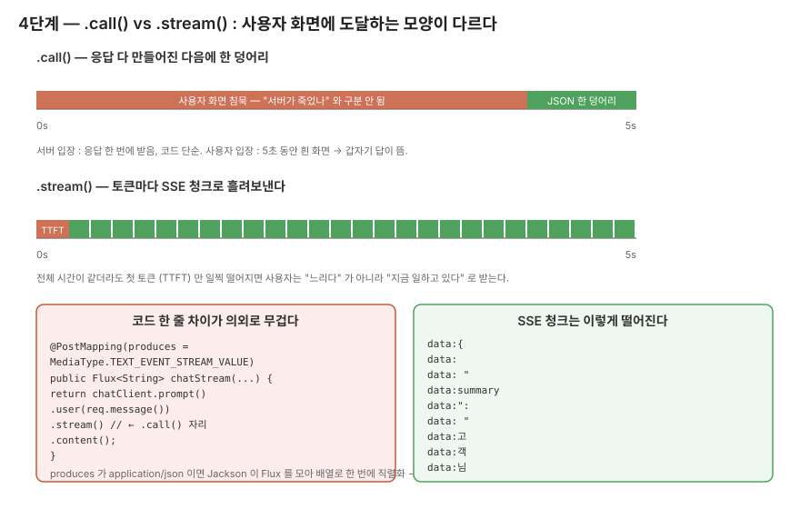

# 4단계 — `.call()` → `.stream()` 으로 SSE 흘리기

> 1단계에서 풀어둔 게 다는 아니었어요. 글로 푼 거랑 손으로 구현하는 건 또 다릅니다.

## 이 단계에서 마주치는 질문

1단계에서 "WebFlux 로 갈아엎는 게 아니라 MVC 위에서도 `Flux` 반환이 된다" 까지 정리해뒀어요.
그래서 4단계 시작은 "그냥 `.call()` 자리에 `.stream().content()` 만 끼우면 되는 거 아닌가" 정도로 가볍게 보입니다. 실제로 컨트롤러 코드만 보면 정말 그게 다예요.

```java
return chatClient.prompt()
        .user(req.message())
        .stream()
        .content();
```

손이 멈추는 건 그 위 한 줄 — `@PostMapping(produces = MediaType.TEXT_EVENT_STREAM_VALUE)`. 이게 왜 SSE 미디어 타입이어야 하는지 한 박자 짚고 가는 자리입니다.

## .call() 과 .stream() 이 사용자에게 도달하는 모양



`.call()` 은 응답이 다 만들어진 다음 한 덩어리로 떨어집니다. 5초 동안 사용자 화면은 흰색. 그러다 갑자기 JSON 한 덩어리가 뜹니다.
`.stream()` 은 토큰마다 SSE 청크로 흘러나옵니다. TTFT (Time To First Token) 만 짧으면 사용자는 "느리다" 가 아니라 "지금 일하고 있다" 로 받습니다.

전체 응답 시간이 같더라도 사용자가 받는 느낌이 완전히 다른 자리예요. 이게 1단계에서 "두 결 중 사용자 체감 쪽" 으로 적어뒀던 자리의 답입니다.

## produces = text/event-stream 이 왜 필요한가

`Flux<String>` 을 반환한다고 자동으로 토큰 단위 스트리밍이 되는 건 아니에요. 응답을 어떤 미디어 타입으로 직렬화하느냐에 따라 클라이언트가 받는 모양이 달라집니다.

기본 `application/json` 으로 두면 Jackson 이 `Flux` 를 통째로 모아서 배열로 직렬화합니다. 모든 토큰이 다 모인 다음에 한 덩어리로 떨어져요. 백엔드는 토큰을 흘려보내는데 클라이언트는 한 번에 받는, 의도와 정반대 상황이 됩니다.

`text/event-stream` 으로 바꾸면 SSE 직렬화 경로로 들어가서 `Flux` 가 emit 할 때마다 `data: ...\n\n` 형식으로 한 청크씩 흘러나갑니다. 브라우저든 `curl -N` 이든 받자마자 한 청크씩 표시할 수 있게 됩니다.

이 한 줄이 빠지면 그림이 완전히 달라지니까, 다른 컨트롤러 자리에서 `Flux` 를 반환하는 경우가 또 있다면 미디어 타입 한 번 더 확인하고 가세요.

## ChatClient 빌드 패턴은 그대로 가져간다

2단계의 `SupportController` 와 같은 패턴이에요.

```java
public StreamingChatController(ChatClient.Builder builder) {
    this.chatClient = builder
            .defaultSystem(BaedalPrompt.SYSTEM_PROMPT)
            .build();
}
```

3단계의 `PromptLabController` 는 요청마다 system prompt 가 바뀌니까 매 요청 빌드인데, 이 컨트롤러는 트리아지와 같은 시스템 프롬프트를 그대로 쓰니까 생성자에서 한 번 빌드해두고 재사용합니다.

테스트로 "한 번만 빌드되는지" 확인 케이스를 또 하나 넣었어요. 매번 작성하기는 번거롭지만, 매 요청 빌드되는 컨트롤러가 섞여 있으면 운영에서 보고 헷갈리니까 컨트롤러마다 가드를 두기로 한 자리입니다.

## 트리아지 (JSON) 와 스트리밍 (자연어) 의 균형이 어색해지는 자리

실측에서 그대로 잡힌 자리예요. `curl -N` 으로 두드린 raw 스트림 첫 십수 줄이 이렇게 나옵니다.

```text
data:{
data:
data: 
data: "
data:summary
data:":
data: "
data:고
data:객
data:님
data: 말씀
```

`StreamingChatController` 가 `BaedalPrompt.SYSTEM_PROMPT` 를 그대로 쓰니까 모델은 JSON 으로 답합니다. `.stream()` 은 그걸 토큰 단위로 흘려보내고요. 결과적으로 JSON 한 글자 한 글자가 SSE 청크로 떨어집니다.

클라이언트가 부분 JSON 청크를 받아도 파싱이 안 되니까, 결국 다 받아서 합쳐야 의미가 생겨요. 그러면 `.call()` 이랑 사실상 같아지고, TTFT 만 좀 짧아질 뿐 사용성 이득은 사라집니다.

여기서 깨끗하게 잡힌 다음 라운드 영역이 있어요. **스트리밍용 시스템 프롬프트는 따로 분리해야 합니다.** "JSON 외 다른 텍스트 출력 금지" 한 줄은 트리아지 컨트롤러 쪽에만 남기고, 스트리밍 쪽은 자연어 답변 + 짧은 안내 톤만 살린 별도 시스템 프롬프트가 필요해요. 1주차 범위 밖이라 미뤘지만, 4단계 끝의 가장 또렷한 결론입니다.

## 단위 테스트로는 못 보는 자리

`StreamingChatControllerTest` 가 보장하는 건 두 가지예요.

1. SYSTEM_PROMPT 가 `defaultSystem` 으로 전달되고, `Flux.just(...)` 로 stub 한 스트림이 컨트롤러 밖으로 그대로 나간다.
2. 같은 컨트롤러 인스턴스로 두 번 호출해도 `builder.build()` 가 1회만 돈다.

여기서 "스트리밍이 잘 동작한다" 까지는 보장이 안 됩니다.
TTFT 가 짧은지, Tomcat 의 async 처리가 풀려나는지, SSE 형식으로 직렬화돼서 클라이언트 화면에 한 글자씩 떨어지는지 — 이건 `curl -N` 으로 직접 두드려야 보입니다. 단위 테스트는 stub 한 Flux 가 컨트롤러 통과만 보는 자리예요.

## 코드 자리

- `src/main/java/com/baedal/support/StreamingChatController.java` — `.stream().content()` 한 줄, `produces = TEXT_EVENT_STREAM_VALUE`
- `src/test/java/com/baedal/support/StreamingChatControllerTest.java` — Flux stub + 빌드 1회 가드
- `src/test/java/com/baedal/support/StreamingChatControllerValidationTest.java` — 컨트롤러 경계의 Bean Validation

## 직접 두드려보기

```bash
curl -N -X POST http://localhost:8080/api/v1/chat/stream \
  -H "Content-Type: application/json" \
  -d '{"message":"주문번호 2024-1234 배달 어디쯤에 있어요?"}'
```

`-N` (no-buffering) 빼면 SSE 청크가 한꺼번에 떨어집니다. 이 옵션이 빠진 채로 보면 "어? 스트리밍이 안 되는 거 같은데?" 가 되기 쉬워서, 처음 두드릴 땐 꼭 같이 박으세요.

raw 스트림 모양과 총 시간 (~4.58s, 186 chunk) 은 [`docs/1주차/실측-raw/stream-curl-N.md`](../실측-raw/stream-curl-N.md) 에 같이 있어요.

## 한 번 더 손으로 확인하고 가는 자리

데이터로 확인된 자리:

- SSE 직렬화는 의도대로 작동. produces 가 `text/event-stream` 일 때 청크마다 `data:` prefix 가 붙어 흘러나옴.
- 트리아지 시스템 프롬프트 + `.stream()` 조합은 사용성을 깎는다 — JSON 청크는 클라이언트가 못 씀.

추정으로 남은 자리:

- 클라이언트가 중간에 끊었을 때 `Flux` cancel 신호가 Ollama 호출까지 전파되는지 — 미확인. 토큰 비용이 어디서 끊기는지 모름.
- TTFT 가 advisor 레벨에서 잡히는지 — `CallAdvisor` 는 `.call()` 경로용이고 `.stream()` 경로는 별도 (`StreamAdvisor` 추정) — 5단계에서 다시 만남.
- 스트리밍용 시스템 프롬프트 분리 — 다음 라운드 영역으로 굳어진 자리.

이전 단계 ← [03. 3단계 — 프롬프트 정량 비교](03-단계3-프롬프트정량비교.md) ・ 다음 단계 → [05. 5단계 — Advisor 와 로깅](05-단계5-Advisor.md)
