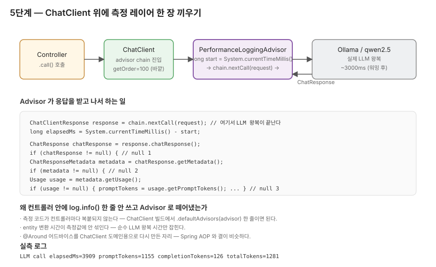

# 5단계 — Advisor 로 측정 레이어 끼우기

> 컨트롤러 끝에 `log.info()` 한 줄 박으면 되는 거 아닌가, 부터 시작합니다.

## 이 단계에서 마주치는 질문

응답 시간이랑 토큰 수를 찍는 거면 `SupportController.triage()` 안에 `long start = ...` 적고 호출 끝나면 `log.info()` 한 줄 추가하면 끝납니다.
그런데 이게 한 컨트롤러에만 통하는 방식이라, 비슷한 컨트롤러가 늘어나면 같은 코드가 컨트롤러마다 복붙됩니다.

또 한 가지 — `SupportController` 는 `.call().entity(SupportResponse.class)` 인데, 측정 코드를 컨트롤러에 박으면 entity 변환 시간까지 측정값에 섞입니다. 순수 LLM 왕복만 보고 싶을 땐 그게 노이즈예요.

5단계는 그래서 측정을 컨트롤러에서 떼어내서 `ChatClient` 위에 한 장의 레이어로 들이는 자리입니다.

## CallAdvisor 가 끼어드는 자리



`CallAdvisor` 는 ChatClient 의 호출 파이프라인에서 `chain.nextCall(request)` 호출 직전/직후를 끼어들 수 있는 자리예요.
체인 자체가 ChatClient 의 호출 파이프라인이라, advisor 를 끼우면 "LLM 호출 그 한 번" 의 앞뒤를 잡을 수 있게 됩니다. 컨트롤러는 advisor 가 끼인 ChatClient 를 그냥 쓸 뿐, 측정 로직은 별도 컴포넌트로 존재합니다.

이게 Spring AOP 의 `@Around` 어드바이스로 메서드 호출 전후를 잡는 패턴과 결이 비슷합니다. ChatClient 가 그 패턴을 자기 도메인용 인터페이스 (`CallAdvisor.adviseCall`) 로 다시 만든 자리예요. 이름이 그래서 같은 "Advisor" 인 것도 우연은 아닐 가능성이 큽니다.

## getOrder = 100 은 무슨 뜻인가

스타터 코드 주석에 이미 "체인 바깥쪽에서 LLM 왕복 시간을 측정하기 위해 큰 값을 준다" 라고 적혀 있어요.

Spring 의 일반 `Ordered` 컨벤션은 작은 값이 먼저 실행되는 쪽입니다. 체인 형태로 advisor 가 끼어들 때 "먼저 실행되는 게 바깥" 이 자연스럽긴 한데, 이 영역은 Spring AI 의 구현체에 따라 다를 수 있어서 단정은 어려워요.
실제로 "바깥쪽" 인지 확인하려면 advisor 두 개를 끼워서 실행 순서를 로그로 찍어보면 됩니다. 거기까진 안 갔고, 일단 starter 주석을 신뢰하는 쪽으로 `getOrder() = 100` 으로 가져갔어요.

## null 검사가 네 번 — 답답하지만 필요한 자리

Usage 메타데이터 꺼내는 코드는 이렇게 됩니다.

```java
ChatResponse chatResponse = response.chatResponse();
if (chatResponse != null) {
    ChatResponseMetadata metadata = chatResponse.getMetadata();
    if (metadata != null) {
        Usage usage = metadata.getUsage();
        if (usage != null) {
            promptTokens = usage.getPromptTokens();
            ...
        }
    }
}
```

`Optional` 로 감싸진 게 아니라 매 단계 nullable 입니다. 매번 null 체크 하는 게 좀 답답하긴 한데, 스타터 주석의 "방어적으로 확인할 것" 안내가 괜한 말이 아니에요.

왜 null 이 떨어질 수 있는가 — Ollama 처럼 토큰 수를 내려주지 않는 모델이 있거나, 토큰 집계가 비활성화된 옵션으로 호출된 경우를 가정한 것 같습니다.
실측에선 `qwen2.5` 가 다섯 건 다 usage 메타데이터를 채워줘서 null 검사가 한 번도 발화 안 했어요 (다음 단락). 그러니까 이 null 검사는 "이 모델에서 자주 발화하는 가드" 라기보다 "다른 모델이나 다른 옵션 대비한 방어 코드" 라는 위치가 좀 더 분명한 자리입니다.

토큰이 진짜 null 인 경우 로그에는 `promptTokens=null` 그대로 떨어지게 했어요. 0 으로 채우면 진짜 0 인 케이스와 구분이 안 되니까, null 그대로 흘리는 쪽이 솔직한 표현입니다.

## SupportController 에만 일단 등록

스타터 힌트가 "SupportController 에 `.defaultAdvisors(performanceAdvisor)` 로 등록" 만 적시한 게 의도라고 봐서 거기서 멈췄어요.

`PromptLabController` 에도 붙이면 정량 비교 결과랑 토큰/응답 시간을 같이 볼 수 있어서 자연스럽긴 합니다. 한 단계에 너무 많은 변경을 묶지 않으려고 일부러 미뤘고, 그게 다음 라운드 영역으로 적힌 자리예요.

`StreamingChatController` 는 더 까다롭습니다. `CallAdvisor` 는 `.call()` 경로용이라 `.stream()` 경로는 안 잡혀요. Spring AI 에 `StreamAdvisor` 가 별도로 있을 가능성이 큰데, 이건 이번 미션 범위 밖. 4단계에서 미해결로 남긴 TTFT 측정이 여기 묶입니다.

## 실측에서 advisor 가 박은 줄

`/api/v1/support` 에 다섯 건 두드린 직후 `bootRun` stdout 에 이렇게 박혔어요.

```text
LLM call elapsedMs=9736 promptTokens=1154 completionTokens=96  totalTokens=1250
LLM call elapsedMs=3909 promptTokens=1155 completionTokens=126 totalTokens=1281
LLM call elapsedMs=3737 promptTokens=1149 completionTokens=118 totalTokens=1267
LLM call elapsedMs=3803 promptTokens=1159 completionTokens=121 totalTokens=1280
LLM call elapsedMs=2938 promptTokens=1157 completionTokens=84  totalTokens=1241
```

여기서 잡히는 게 몇 가지 있어요.

- 다섯 건 다 토큰 카운트가 Integer 로 정상적으로 떨어졌어요 — null 검사가 한 번도 발화 안 함. `qwen2.5` 는 usage 메타데이터를 일관적으로 채워주는 모델이라는 자리.
- `promptTokens` 가 1149~1159 로 거의 안 흔들렸어요. `SYSTEM_PROMPT` 본문이 ~1130 토큰을 차지하니까 자연스러운 수치인데, 매 호출마다 1100+ 토큰의 시스템 프롬프트가 토큰으로 깔린다는 게 데이터로 확인됩니다. 운영에선 캐싱이나 축약을 다음 라운드에 봐야 할 자리.
- `completionTokens` 가 84~126 으로 답변 길이에 따라 갈렸어요. `neededInfo` 가 빈 배열이었던 PAYMENT 가 84, 두 항목 필요했던 SAFETY 가 121. advisor 로그만 봐도 응답이 얼마나 풍부한지 짐작이 됩니다.
- 첫 호출이 ~10초로 길었어요. 워밍업 직후 첫 요청에 모델 로딩이 같이 잡혀서. 운영에선 keep-alive 옵션이나 워밍업 헬스체크로 따로 처리할 영역.

## 실패 경로 로그는 한 번 더 봐야 하는 자리

`PerformanceLoggingAdvisor` 에는 LLM 호출이 실패했을 때 `log.warn("LLM call failed ...")` 가 떨어지게 코드가 있어요 (원래 한 줄에 elapsedMs 만 있었다가, CodeRabbit 리뷰 후 elapsedMs 까지 같이 박는 걸로 한 번 고쳤습니다).

이번 실측에선 Ollama 가 떠 있고 모델도 받아주는 정상 경로만 두드려서 이 로그가 한 번도 발화 안 했어요. 정작 잘 작동하는지는 Ollama 끄거나 모델 이름 틀린 상태에서 한 번 더 두드려봐야 알 수 있는 자리입니다.
복기 중에 시간 되면 한 번 두드려보세요 — `ollama stop qwen2.5` 같은 식으로요.

## 단위 테스트로 보장한 것 / 못 보는 것

`PerformanceLoggingAdvisorTest` 5 케이스가 보장합니다.

1. `adviseCall_delegatesToChain_andReturnsDownstreamResponse` — `chain.nextCall(request)` 호출되고 반환이 그대로 흘러나오는지 (advisor 가 응답을 가로채지 않는지)
2. `adviseCall_isNullSafe_whenChatResponseMissing` — `response.chatResponse()` 가 null 이어도 통과
3. `adviseCall_isNullSafe_whenMetadataMissing` — `chatResponse.getMetadata()` 가 null
4. `adviseCall_isNullSafe_whenUsageMissing` — `metadata.getUsage()` 가 null
5. `advisorMetadata_orderIsHighEnoughForOutermostMeasurement` — `getName()`, `getOrder()` 가 의도대로 박혀있는지

`SupportControllerTest` 두 케이스도 같이 손봤어요. 생성자가 `(builder, advisor)` 로 바뀌었으니까 mock 체인에 `builder.defaultAdvisors(advisor)` 호출 verify 가 추가됐습니다.

여기서 보장 안 되는 자리 :

- `log.info()` 가 진짜 의도된 메시지로 떨어지는가 — Logback capture appender 를 끼워야 검증 가능. 안 했어요.
- 실제 토큰 수가 진짜 모델이 사용한 수와 같은가 — 단위 테스트는 mock 으로 주입된 값을 보는 거라, 진짜 응답에서 그 값이 들어오는지는 직접 두드려야 함. 위 실측 자리에서 확인됨.

## 코드 자리

- `src/main/java/com/baedal/support/PerformanceLoggingAdvisor.java` — `adviseCall(...)`, `getOrder() = 100`, null 가드 3 단계
- `src/main/java/com/baedal/support/SupportController.java` — 생성자에서 `.defaultAdvisors(advisor)` 등록
- `src/test/java/com/baedal/support/PerformanceLoggingAdvisorTest.java` — 5 케이스 (위 목록)

## 직접 두드려보기

2단계의 curl 그대로 한 번 두드리고, `bootRun` 띄운 터미널을 같이 보세요.

```bash
curl -X POST http://localhost:8080/api/v1/support \
  -H "Content-Type: application/json" \
  -d '{"message":"두드러기 났어요"}'
```

`bootRun` stdout 에 `LLM call elapsedMs=... promptTokens=... completionTokens=... totalTokens=...` 한 줄이 떨어집니다. 이 한 줄이 advisor 가 박은 자리예요.

연속으로 두드려보면 첫 호출만 좀 느리고 (모델 로딩) 다음부터는 3~4초 안에 들어옵니다.

## 한 번 더 손으로 확인하고 가는 자리

데이터로 확인된 자리:

- advisor 가 entity 변환 시간 노이즈 없이 LLM 왕복만 측정. elapsedMs 가 깔끔하게 떨어진다.
- `qwen2.5` 는 usage 메타데이터를 일관적으로 채워준다 — null 검사는 다른 모델 대비 방어 코드 위치.
- `promptTokens` 가 매 호출마다 1100+ 로 깔린다 — 시스템 프롬프트 토큰 비용이 운영 가정 때 그대로 두면 안 될 자리.

추정으로 남은 자리:

- 실패 경로 로그가 의도대로 떨어지는가 — Ollama 끄고 한 번 두드려봐야 확정.
- `PromptLabController` / `StreamingChatController` 에 advisor 적용 — 한 줄 변경이지만 4단계 끝의 깔끔한 끊음을 위해 미룬 자리. 다음 손볼 때 같이.
- `.stream()` 경로의 TTFT 측정 — `CallAdvisor` 와 별개. `StreamAdvisor` 가 있을 가능성이 큼.

이전 단계 ← [04. 4단계 — 스트리밍](04-단계4-스트리밍.md) ・ [용어집](용어집.md)
