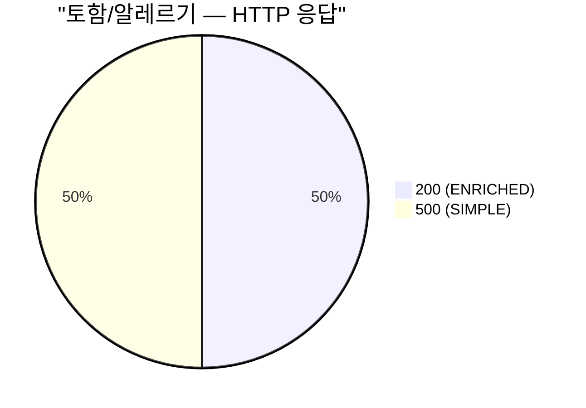
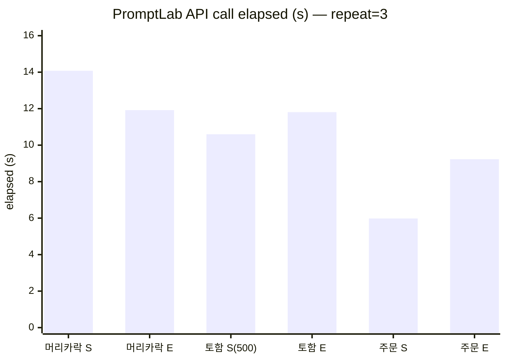

# /api/v1/prompt-lab — SIMPLE vs ENRICHED 비교 raw

회고 04 부록의 원본 데이터예요.

## 비교 조건

- 메시지 세 개를 두 가지 systemPrompt 로 각각 `repeat: 3` 호출
- SIMPLE: `"당신은 친절한 한국 배달 고객 상담사입니다. 고객 문의에 친절하게 답하세요."` (한 줄)
- ENRICHED: 1단계 `BaedalPrompt.SYSTEM_PROMPT` 전체 (~1130 토큰)
- 총 6 API 호출 = 18 LLM 호출 (이 중 한 건은 HTTP 500)

## categoryConsistency 비교

```mermaid
xychart-beta
    title "categoryConsistency: SIMPLE vs ENRICHED"
    x-axis ["머리카락", "토함/알레르기", "주문 취소"]
    y-axis "consistency" 0 --> 1
    bar [1.0, 0, 1.0]
    bar [0.667, 1.0, 1.0]
```



위가 SIMPLE, 아래가 ENRICHED. "토함/알레르기" SIMPLE 의 0 은 HTTP 500 으로 응답을 못 받아서 consistency 계산이 안 된 자리예요.

## 토함/알레르기 메시지의 HTTP 응답



ENRICHED 의 "JSON 외 다른 텍스트는 출력하지 않습니다" 한 줄이 빠지면 `.entity(SupportResponse.class)` 가 그대로 깨진다는 게 잡힌 자리.

## API 호출 별 elapsed



---

## raw 응답 (텍스트 그대로)

### 메시지 1 — "음식에 머리카락이 나왔어요. 너무 화가 납니다."

**SIMPLE**
```json
{"totalRuns":3,"categoryCounts":{"QUALITY":3},"urgencyCounts":{"HIGH":3},"categoryConsistency":1.0}
```
`HTTP=200 elapsed=14.079216s`

**ENRICHED**
```json
{"totalRuns":3,"categoryCounts":{"QUALITY":1,"SAFETY":2},"urgencyCounts":{"CRITICAL":3},"categoryConsistency":0.6666666666666666}
```
`HTTP=200 elapsed=11.919369s`

### 메시지 2 — "어제 시킨 거 먹고 토했어요. 새우 알레르기인 거 같아요."

**SIMPLE**
```json
{"timestamp":"2026-05-16T08:18:18.405+00:00","status":500,"error":"Internal Server Error","path":"/api/v1/prompt-lab"}
```
`HTTP=500 elapsed=10.597117s`

**ENRICHED**
```json
{"totalRuns":3,"categoryCounts":{"SAFETY":3},"urgencyCounts":{"HIGH":2,"CRITICAL":1},"categoryConsistency":1.0}
```
`HTTP=200 elapsed=11.806095s`

### 메시지 3 — "주문 취소하고 싶어요."

**SIMPLE**
```json
{"totalRuns":3,"categoryCounts":{"ORDER":3},"urgencyCounts":{"NORMAL":3},"categoryConsistency":1.0}
```
`HTTP=200 elapsed=5.977500s`

**ENRICHED**
```json
{"totalRuns":3,"categoryCounts":{"ORDER":3},"urgencyCounts":{"NORMAL":3},"categoryConsistency":1.0}
```
`HTTP=200 elapsed=9.227479s`
