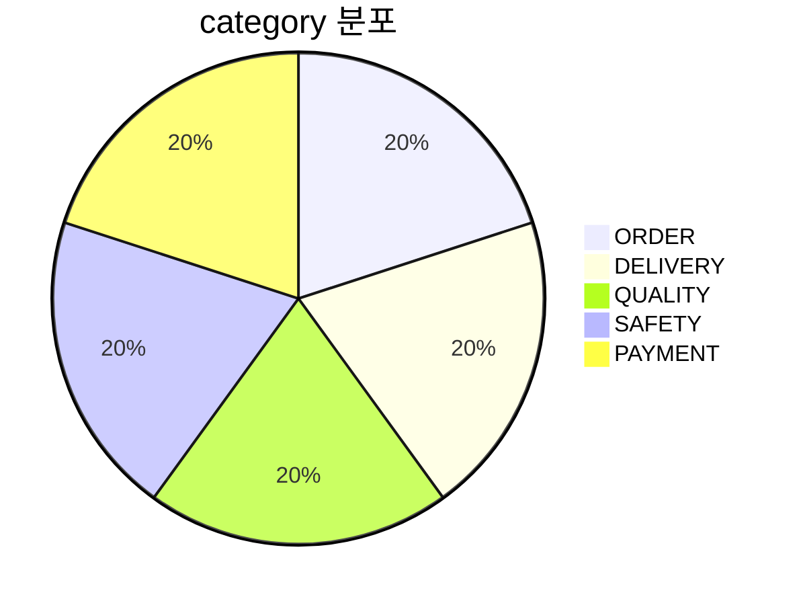
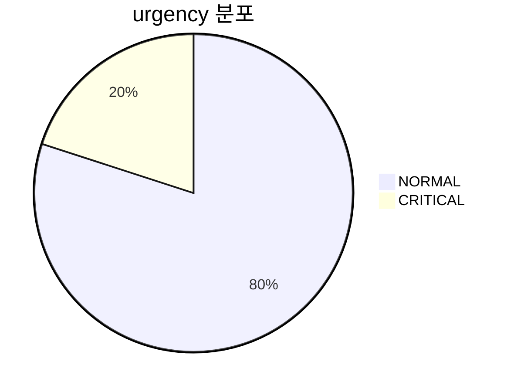
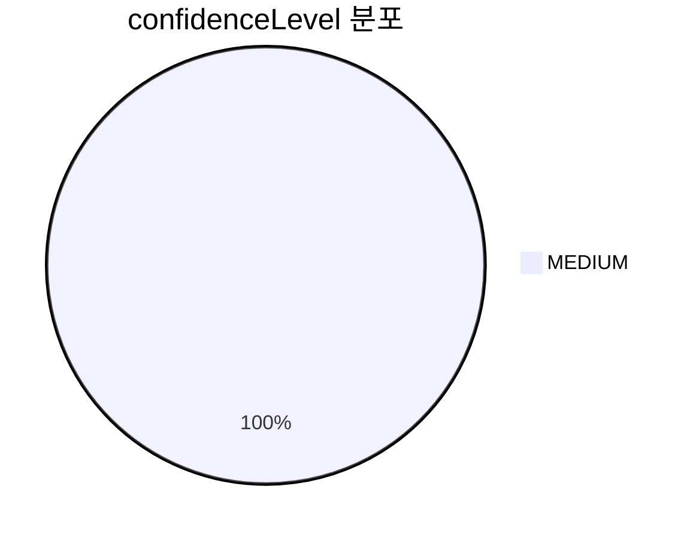
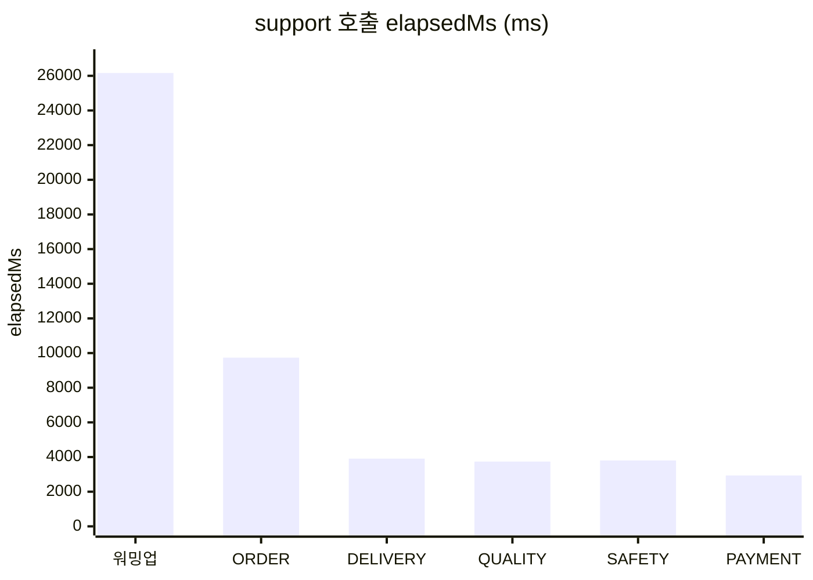

# /api/v1/support — 다섯 건 raw 응답

회고 03 / 06 부록에서 인용한 숫자의 원본입니다. bootRun PID 48091 에서 `2026-05-16T14:41` 전후로 직접 두드린 결과예요.

## 호출 환경

- Ollama `qwen2.5:latest` (4.7GB)
- `application.yml`: `temperature: 0.3`, `base-url: http://localhost:11434`
- 워밍업 1건 (별도 시점) 직후 다섯 건을 직렬로 호출

호출 명령은 다음 형식.

```bash
curl -sS -X POST http://localhost:8080/api/v1/support \
  -H "Content-Type: application/json" \
  -d '{"message":"<아래 메시지 그대로>"}'
```

## 카테고리 분포 (5건)



다섯 건이 모두 다른 카테고리로 깔끔하게 떨어졌어요. 회고 03 에서 카테고리 7 개로 잘랐는데, 그 중 5 개가 다 발화한 그림.

## urgency 분포



CRITICAL 한 건이 SAFETY 케이스. 시스템 프롬프트의 식품 안전 가드레일이 발화한 자리.

## confidenceLevel 분포



다섯 건 다 MEDIUM. 회고 03 끝 부록에 적어둔 의심 (모델이 가운데 값에 던지는 습관이 있다는 가설) 이 이 데이터에서 짙어졌어요.

## 응답 시간



## 토큰

```mermaid
xychart-beta
    title "promptTokens (회색) vs completionTokens (검정)"
    x-axis ["ORDER", "DELIVERY", "QUALITY", "SAFETY", "PAYMENT"]
    y-axis "tokens" 0 --> 1300
    bar [1154, 1155, 1149, 1159, 1157]
    bar [96, 126, 118, 121, 84]
```



promptTokens 가 1149~1159 사이로 거의 안 흔들렸어요. SYSTEM_PROMPT 본문이 ~1130 토큰을 차지하는 게 그대로 보이는 자리.

---

## raw 응답 (텍스트 그대로)

### 1) ORDER — "주문번호 2024-1234 주문 취소하고 싶어요."

```json
{
  "summary": "고객님 말씀에 따르면, 주문번호 2024-1234의 주문이 취소되어야 합니다.",
  "category": "ORDER",
  "urgency": "NORMAL",
  "nextAction": "상담사가 주문 취소 요청을 처리합니다.",
  "neededInfo": [],
  "estimatedResolutionMinutes": null,
  "confidenceLevel": "MEDIUM"
}
```

`HTTP_CODE=200 CURL_ELAPSED=9.755180s`

### 2) DELIVERY — "30분 됐는데 아직 배달이 안 와요. 어디쯤인지 알 수 있을까요?"

```json
{
  "summary": "고객님 말씀에 따르면, 현재 배달이 지연된 상태로 30분이 지난 시점에서 배달 위치를 확인하고자 합니다.",
  "category": "DELIVERY",
  "urgency": "NORMAL",
  "nextAction": "주문 정보 확인 후 라이더 연락처 확인하여 배송 현황 문의",
  "neededInfo": ["주문번호","배달지 주소"],
  "estimatedResolutionMinutes": null,
  "confidenceLevel": "MEDIUM"
}
```

`HTTP_CODE=200 CURL_ELAPSED=3.923662s`

### 3) QUALITY — "음식 양이 너무 적어요. 사진 첨부할게요."

```json
{
  "summary": "고객님이 주문하신 음식의 양이 적다고 호소하셨습니다. 사진이 첨부되었습니다.",
  "category": "QUALITY",
  "urgency": "NORMAL",
  "nextAction": "사진을 확인한 후 고객님 말씀에 따른 음식 양 문제를 조사합니다.",
  "neededInfo": ["주문번호","주문 시각"],
  "estimatedResolutionMinutes": null,
  "confidenceLevel": "MEDIUM"
}
```

`HTTP_CODE=200 CURL_ELAPSED=3.750732s`

### 4) SAFETY — "어제 시킨 거 먹고 두드러기가 났어요. 새우 알레르기인지 모르겠어요."

```json
{
  "summary": "고객님 말씀에 따르면, 어제 주문하신 음식물을 먹은 후 두드러기가 났으며, 새우 알레르기 가능성을 제기하였습니다.",
  "category": "SAFETY",
  "urgency": "CRITICAL",
  "nextAction": "의료기관 방문을 권유합니다.",
  "neededInfo": ["주문번호","주문 시각"],
  "estimatedResolutionMinutes": null,
  "confidenceLevel": "MEDIUM"
}
```

`HTTP_CODE=200 CURL_ELAPSED=3.813634s`

### 5) PAYMENT — "결제가 두 번 됐어요. 같은 주문인데 카드에서 두 번 빠졌습니다."

```json
{
  "summary": "고객님 말씀에 따르면, 결제가 두 번 이루어졌습니다.",
  "category": "PAYMENT",
  "urgency": "NORMAL",
  "nextAction": "사람 상담사가 검토 후 안내드립니다.",
  "neededInfo": [],
  "estimatedResolutionMinutes": null,
  "confidenceLevel": "MEDIUM"
}
```

`HTTP_CODE=200 CURL_ELAPSED=2.946943s`
