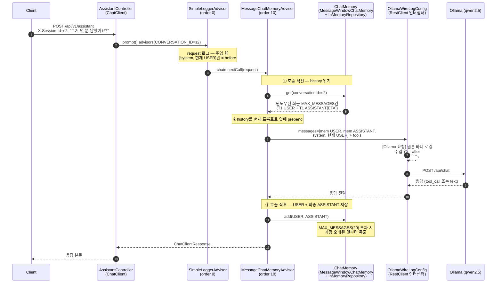

# Week3 4단계 — Memory 토큰 증가 관찰 리포트

> 목표: **"Memory가 매 턴 프롬프트 조립 시점(advisor order 10)에 끼어들어 입력 토큰을 키운다"**를
> 단일 세션 10턴 실행 로그로 직접 관찰·증명한다.
> 측정 인프라는 1단계에서 구성된 `PerCallObservationHandler`(매 LLM 호출 `[LLM #N] input/output`) +
> `PerformanceLoggingAdvisor`(턴 합계 `[PERF]`)를 그대로 사용했다(신규 자바 코드 없음).

## 1. 실행 정보

| 항목 | 값 |
|---|---|
| 모델 | `qwen2.5:14b` (temperature 0.3) |
| 브랜치 / 커밋 | `week3/feature01_v5(step3)` / `63abb8e` |
| `MAX_MESSAGES` | `20` (`ChatMemoryConfig.java:32`, `MessageWindowChatMemory`) |
| cases | `docs/week3/stage4/memory_token_growth/cases.json` (2단계 `memory_size` POST 10턴과 동일, 세션 `s2`) |
| 러너 | `docs/verification_memory/run_memory_scenarios.sh` (서버 자동 기동·종료) |
| 산출물 | `responses/cases/step{1..10}.json` + `step{1..10}_logs.log` + `server.log` (gitignore) |
| 토큰 출처 | `server.log` (step별 로그는 비동기 flush로 인접 step에 새어 정렬이 어긋나, **턴 귀속은 server.log를 `[Assistant]`→`[PERF]` 구간으로 재구성**) |

## 2. 매 턴 입력 토큰 표

입력 토큰 = 그 턴 **첫 LLM 호출** `[LLM #1] input` (= SYSTEM 프롬프트 + Tool 스키마 3개 + 주입된 Memory 이력 + 이번 USER).

| 턴 | message | 입력 토큰 `[LLM #1]` | 직전 대비 증가 | 출력 `[PERF] 누적출력` | elapsed `[PERF]`(ms) | 총호출 | Tool 실호출 |
|---|---|---|---|---|---|---|---|
| 1 | 2024-1234 배달 상황 알려주세요 | **2651** | — | 161 | 28145 ⚠️ | 2 | getDeliveryStatus(1234) |
| 2 | 그거 몇 분 남았어요? | 2788 | +137 | 104 | 20967 ⚠️ | 1 | — (회상) |
| 3 | 2024-1235 메뉴 뭐였죠? | 2921 | +133 | 82 | 4044 | 1 | — (미호출) |
| 4 | 아 그 버거 세트 | 3018 | +97 | 86 | 4254 | 1 | — |
| 5 | 2024-1234 취소 가능해요? | 3128 | +110 | 174 | 7294 | 2 | getOrderDetail(1234) |
| 6 | 그럼 1235는 취소되죠? | 3224 | +96 | 193 | 8423 | 2 | getOrderDetail(1235) |
| 7 | 그거 취소해주세요 | 3332 | +108 | 256 | 11674 | 2 | cancelOrder(1235) |
| 8 | 아까 1234는 언제 도착해요? | 3537 | +205 | 90 | 5750 | 1 | — (회상) |
| 9 | 그 주문 라이더 위치 다시 확인 | 3646 | +109 | 90 | 4504 | 1 | — (회상) |
| 10 | 요약해 주세요 … | **3761** | +115 | 296 | 14412 | 1 | — |

- ⚠️ 턴1·2의 `elapsed`는 모델 콜드 스타트(가중치 로딩)가 섞여 부풀려진 값이다. 토큰이 깨끗한 신호이고, 시간은 보조 지표로만 본다.
- 총호출=2인 턴(1·5·6·7)은 Tool Calling이 일어나 `internalCall`이 재귀한 턴이다. 표의 입력 토큰은 그 턴 **첫 호출**값이며, 2차 호출 `[LLM #2]`는 ToolResponse가 더해져 더 크다(예: 턴7 `[LLM #2] input=6768`).
- **표에 1차 호출값만 쓴 이유**: 이 실험이 보려는 건 "Memory가 쌓이며 입력이 커지는가" 하나다.
  - `[LLM #1]` 입력 = `SYSTEM + Tool 스키마 + 누적 Memory + 이번 USER`의 순수한 합 → Memory 증가분을 깨끗하게 드러낸다.
  - `[LLM #2]` 입력 = 거기에 **그 턴에 호출된 Tool의 결과(ToolResponse) 크기**까지 섞인다. 이 크기는 어떤 Tool이 불렸는지·결과가 얼마나 긴지에 따라 들쭉날쭉이라, Memory 효과만 보려는 표에는 잡음이 된다.
  - 그래서 모든 턴을 **1차 호출값으로 통일**해 같은 기준으로 비교했고, Tool 턴에서만 존재하는 2차 호출은 본문에서 "참고로 더 크다"로만 언급한다.

## 3. 분석 — 1턴 대비 10턴, 토큰 차이와 토큰 증가의 원인
> **결론**
> - 1턴 → 10턴 입력이 1.42배(+1110토큰)로 커진 원인은 **전적으로 Memory에 누적된 이전 메시지**다.
> - **Tool 스키마**는 입력을 *처음부터 크게(2651)* 만드는 고정 비용이고, *턴이 갈수록 더 커지게* 만드는 건 **Memory**다.

### 3-A. 배수 — 약 1.42배

```text
배수   = 10턴 입력 ÷ 1턴 입력 = 3761 ÷ 2651 ≈ 1.42배
순증가 = 3761 − 2651          = +1110 토큰
```

- 질문 형태는 비슷한데 **10턴째 입력이 1턴째의 약 1.42배**다.
- 줄어든 구간 없이 매 턴 늘기만 했다 (2651 → … → 3761).

### 3-B. 입력은 무엇으로 이루어지나 — 고정비 + 변동비

매 턴 LLM에 들어가는 입력 토큰은 네 덩어리의 합이다.

```text
입력 = (1) SYSTEM 프롬프트 + (2) Tool 스키마 ×3개 + (3) Memory 이력 + (4)이번 USER
       └──────── 고정비: 매 턴 그대로 ────────┘     └─ 변동비 ─┘      └ 거의 일정 ┘
                                                (턴마다 누적)
```

| 덩어리 | 성격 | 내용 |
|---|---|---|
| SYSTEM 프롬프트 | 고정 | 역할·Tool 사용 규칙·금지 사항 (긴 지침) |
| **Tool 스키마 ×3** | 고정 | `getOrderDetail`·`getDeliveryStatus`·`cancelOrder`의 description + JSON 파라미터 스키마 |
| **Memory 이력** | **누적** | 이전 턴들의 USER+ASSISTANT가 매 턴 입력 앞에 prepend |
| 이번 USER | 거의 일정 | 그 턴 질문 한 줄 |

- **턴1 입력 2651**은 history가 없으니 사실상 전부 고정비다(SYSTEM + Tool 스키마 + 첫 질문).
  → 입력이 **처음부터 큰 이유 = Tool 스키마**. description과 JSON 스키마가 3개나 붙어 무겁다.
- **턴이 갈수록 커지는 부분 = Memory 이력**. 이전 대화가 한 턴씩 쌓여 매 턴 입력 앞에 더해진다.

### 3-C. 증가분은 전부 Memory에서 — 스택 비교

```text
턴1  (2651 토큰)
┌──────────────────────────────────────┐
│ 고정비  SYSTEM + Tool 스키마 ×3 + USER │   ← Memory 0
└──────────────────────────────────────┘

턴10 (3761 토큰,  ×1.42)
┌──────────────────────────────────────┬──────────────┐
│ 고정비  SYSTEM + Tool 스키마 ×3 + USER │ Memory +1110 │   ← 9턴 누적
└──────────────────────────────────────┴──────────────┘
  └────────── 턴1과 동일 (~2651) ────────┘
```

- 왼쪽 **고정비 블록은 턴1·턴10이 똑같다** — Tool 스키마는 턴1부터 깔려 있어 증가에는 기여하지 않는다.
- 늘어난 건 오른쪽 **Memory 블록 +1110 토큰**뿐 = 윈도우 안에 쌓인 9턴치 USER+ASSISTANT.


## 4. Memory 주입 증명 — "조립 시점에 끼어든다"

2~3절의 토큰 증가는 "매 턴 Memory가 프롬프트에 더해진다"는 전제 위에 있다. 그 전제를 단순히 "최종 프롬프트에 Memory가 있다"(결과)가 아니라 **"advisor order 10의 조립 단계에서 이력이 끼워진다"(시점)**까지 못 박아 증명한다. 결과만으론 "원래 있었나 / 중간에 들어왔나"를 못 가르기 때문이다.

순서: **[1] 어디서(체인 위치) → [2] 어떻게(코드) → [3] 흐름(시퀀스) → [4] 실측(같은 턴 로그)**.

### [1] 어디서 — advisor 체인에서 order 10이 주입 지점

advisor는 order 오름차순으로 실행된다(낮을수록 바깥=먼저). 그래서 **같은 한 턴**을 체인의 여러 지점에서 관찰할 수 있고, 주입 전/후가 갈린다.

| 관찰 지점 | order | Memory 기준 | 그 지점의 프롬프트 |
|---|---|---|---|
| `SimpleLoggerAdvisor` | 0 | 주입 **전** | system + 현재 USER만 |
| `MessageChatMemoryAdvisor` | 10 | **주입 지점** | 이력을 앞에 prepend |
| `OllamaWireLogConfig` | wire | 주입 **후**(전송 직전) | Memory 포함 전문 |
| `PerformanceLoggingAdvisor` | 100 | 주입 후 | 토큰·시간만(프롬프트 미출력) |

→ order 0(주입 전)과 wire(주입 후)가 **다르면**, 그 사이 **order 10**에서 끼워진 것이다. 이 대조가 [3]·[4]의 뼈대다. (`MessageChatMemoryAdvisor`는 Repository·`MessageWindowChatMemory`·Advisor 3개 Bean의 협력으로 동작한다.)

### [2] 어떻게 — `before()`가 `chain.nextCall` 전에 prepend

`MessageChatMemoryAdvisor`는 `adviseCall`을 직접 구현하지 않고 `BaseAdvisor` 기본 구현을 쓴다. 거기서 **`before()`가 `chain.nextCall()`보다 먼저** 실행된다.

```java
// BaseAdvisor.adviseCall (default) — 오케스트레이션
ChatClientRequest processed = before(req, chain);     // ① memory 조립 (nextCall 前)
ChatClientResponse resp = chain.nextCall(processed);  // ② 조립된 request를 안쪽(→LLM)으로
return after(resp, chain);                            // ③ 응답을 memory에 저장
```

```java
// MessageChatMemoryAdvisor.before — 실제 조립
List<Message> memoryMessages = chatMemory.get(conversationId);     // ① 이력 읽기 [T1u, T1a]
List<Message> processedMessages = new ArrayList<>(memoryMessages); // ② memory를 '먼저' 깔고
processedMessages.addAll(req.prompt().getInstructions());          //    뒤에 [system, 현재 user]
ChatClientRequest processed = req.mutate()                         // ③ 이력 붙은 새 request로 mutate
    .prompt(req.prompt().mutate().messages(processedMessages).build()).build();
chatMemory.add(conversationId, processed.prompt().getUserMessage()); // ④ 이번 user 저장
return processed;                                                  //    → 이게 nextCall로 내려감
// after(): chatMemory.add(conversationId, assistantMessages)      ← 응답도 저장(다음 턴 ①이 읽음)
```

- **②번 줄이 prepend의 실체** — memory를 먼저 담고 현재 `[system, user]`를 뒤에 붙인다. 그래서 순서가 `[mem user, mem assistant, system, 현재 user]`(SYSTEM보다 앞)가 된다.
- **③ `mutate()`** 가 "조립" — 원본을 두고 이력이 붙은 *새* `ChatClientRequest`를 만들어 반환한다.
- 이 모두가 `before()` 안, 즉 **`chain.nextCall` 전**이다 → "조립 시점에 끼어든다"가 **코드로 확정**된다.

### [3] 흐름 — 한 턴(T2)의 시퀀스

[1]의 관찰 지점과 [2]의 ①②③를 한 그림에. `before`는 order 0(prepend 전), `after`는 wire(prepend 후)에서 잡힌다.



### [4] 실측 — 같은 턴(T2 "그거 몇 분 남았어요?")을 두 지점에서

이론을 로그로 확인한다. 같은 T2 요청을 order 0과 wire에서 떠본다. SYSTEM 본문은 `# 역할 …`로 축약.

**before — order 0 `SimpleLoggerAdvisor` (server.log:468)** · Memory 없음, system + 현재 USER만:

```text
messages = [ SystemMessage{ "# 역할 … (생략)" },
             UserMessage{ "그거 몇 분 남았어요?" } ]
```

**after — wire `OllamaWireLogConfig` (server.log:577)** · 1회차 USER+ASSISTANT가 앞에 추가됨(`+` 줄):

```diff
  "messages": [
+   { "role": "user",      "content": "2024-1234 배달 상황 알려주세요" },          // 1회차 USER (Memory 주입)
+   { "role": "assistant", "content": "…역삼역 사거리…오후 5시 31분경 도착…" },   // 1회차 ASSISTANT (Memory 주입)
    { "role": "system",    "content": "# 역할 … (생략)" },
    { "role": "user",      "content": "그거 몇 분 남았어요?" }
  ]
```

> **결론**: 같은 T2 요청인데 order 0에선 **2건(Memory 없음)**, wire에선 **4건(앞에 2건 추가)**. USER는 동일한데 차이가 생긴 유일한 원인은 그 사이 **order 10 `MessageChatMemoryAdvisor.before()`의 prepend**다. → "Memory는 프롬프트 **조립 시점**에 끼어든다"가 **코드([2]) · 시퀀스([3]) · 로그([4])** 3중으로 증명된다. 추가된 이 2건이 곧 입력 토큰 **+137**(2651 → 2788, 2절 표)이다.


## 6. 종합

- 단일 세션 10턴에서 입력 토큰은 **2651 → 3761(약 1.42배)**로 **단조 증가**했고, 증가분 ~1110토큰은 전부 **누적 Memory 이력**에서 왔다.
- 한 턴은 **USER+ASSISTANT 2건**만 적재되어 20건 윈도우는 **약 10턴에 포화** — 이번 실행은 그 직전까지라 평탄화는 관찰되지 않았다(11턴 이후 시작).
- wire JSON 비교로 **Memory가 프롬프트 조립 시점(order 10)에 SYSTEM보다 앞에 prepend**되는 것을 눈으로 확인했다 — 토큰 증가의 메커니즘이 "조립 시점 주입"임이 증명됐다.
