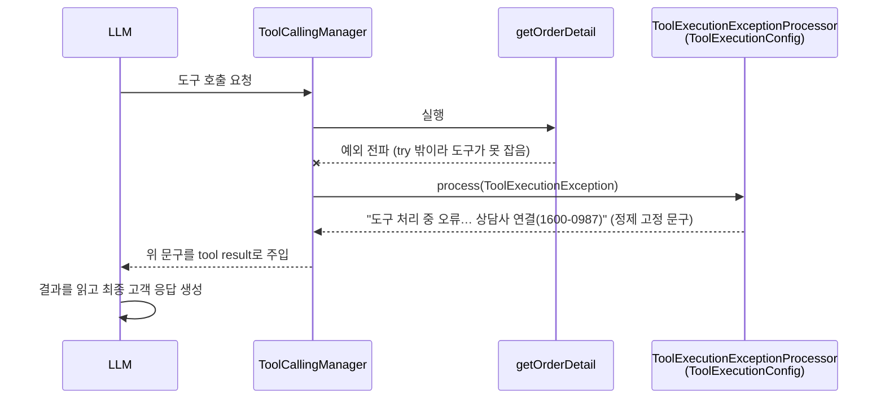

# 5주차 4단계 — Tool/LLM 실패 처리 4계층 

**목적** : 배달 상담 에이전트가 LLM·Tool·RAG·인프라 실패 상황에서도 **내부 정보(스택·예외 원문)를 노출하지 않고 일관된 고객 안내**를 하도록, 실패를 성격별 4계층으로 나눠 처리한다. 이 문서 하나로 설계·구현·검증을 모두 담는다(독립형).

---

## TL;DR

- 실패는 성격에 따라 **4계층**에서 따로 처리한다: ① 업무 실패 → ② 일시/영구 오류 → ③ 못 잡은 예외 → ④ 인프라 다운. **4계층 모두 구현 완료.**
- 핵심 원칙: *"예외를 LLM에 넘기는 것"이 문제가 아니라 **raw 메시지를 가공 없이 넘기는 것**이 문제다.* → 각 층은 실패를 **구조화된 값** 또는 **정제된 문구**로 바꿔 전달하고, 실제 예외·스택은 내부 로그에만 남긴다.
- 결과: 어떤 실패든 고객에게는 상황에 맞는 안내(재시도 / 상담사 연결 `1600-0987`)로 수렴하고, 내부 정보는 새지 않는다.

| 층 | 처리 대상 | 처리 위치 | 상태                           |
|---|---|---|------------------------------|
| **1** | 예상된 업무 실패 (주문 없음·취소 불가·형식 오류) | Tool 반환값(outcome/null) | 동작: 읽기 툴은 `null`, 쓰기 툴은 구조값. |
| **2** | 도구가 잡는 시스템 오류 (DB 타임아웃·코드 버그) | Tool 내부 `try-catch` → `error` DTO(`errorKind`) | ✅ 구현 완료                      |
| **3** | 도구가 못 잡고 던진 예외 | 전역 `ToolExecutionExceptionProcessor` (`ToolExecutionConfig`) | ✅ 구현 완료                      |
| **4** | LLM/임베딩 연결 자체 다운 | 컨트롤러 `try/catch` fallback (`AssistantController`) | ✅ 구현 완료                      |

---

## 1. 배경 — raw 예외가 LLM·고객에 새는 문제

도구가 예외를 던지면, Spring AI 기본 `DefaultToolExecutionExceptionProcessor`(기본값 `alwaysThrow=false`)가 이를 가로채 **`e.getMessage()` 원문을 Tool 결과로 LLM에 그대로 넘긴다.** LLM은 그 원문을 보고 즉석에서 사과문을 생성한다. 이때 두 가지가 위험하다.

- **내부 정보 유출** — 예외 메시지(심하면 SQL·파일경로·내부 ID·스택 힌트)가 LLM 컨텍스트에 주입되고, 최악의 경우 고객 응답까지 새어 나갈 수 있다.
- **응답 일관성 상실** — LLM이 매번 다르게 사과문을 지어내, 브랜드 톤·상담원 연결 번호(`1600-0987`) 안내가 보장되지 않는다.

→ 그래서 각 층은 실패를 **자기설명적 값/정제 문구**로 바꿔 LLM·고객에게 전달한다.

---

## 2. 4계층 한눈에

각 층이 실제로 어떻게 동작하는지 (트리거 → 코드 → LLM이 받는 것 → 최종 결과). ※ 값은 실측 기준.

| 층 | 트리거 예시 | 코드 (반환/메커니즘) | LLM이 받는 것 | 최종 결과                                     |
|---|---|---|---|-------------------------------------------|
| **1** 업무 실패 | "9999-9999 취소" (없는 주문) | `return new CancelOrderResult(id, NOT_FOUND, "…찾을 수 없습니다.")` | 구조화 값 `{outcome: NOT_FOUND}` | "해당 주문번호를 찾을 수 없습니다" 안내                   |
| **2** 시스템 오류 | DB 타임아웃·네트워크 단절·락 경합(일시) / 제약 위반(영구) — 도구 `try` 안 | `catch(e){ kind=classify(e); return OrderDetailView.error(id, kind); }` | `{error:true, errorKind:"TRANSIENT"\|"PERMANENT"}` | TRANSIENT(일시적)→"재시도" / PERMANENT→"상담사 연결" |
| **3** 못 잡은 예외 | `try` 밖 throw / try-catch 없는 툴 | 전역 `ToolExecutionExceptionProcessor` 빈(`ToolExecutionConfig`) → 정제 고정 문구 | `"도구 처리 중 오류… 상담사 연결(1600-0987)"` | LLM이 받은 문구를 **그대로 답하지 않고 재해석**해 "상담사 연결" 안내 생성 (비결정·raw 미노출) |
| **4** 인프라 다운 | Ollama 중지 | 컨트롤러 `try/catch` → `fallback(e)` | — (LLM 도달 못 함) | fallback 문구 + `1600-0987`, 스택 비노출         |

> 어떤 층이 타는지는 **예외가 어디서 잡히느냐**로 갈린다: 도구 `try` 안(2) → 도구 밖(3) → 컨트롤러(4).

> ❓ **(질문 — 확인 필요)** **LLM은 받은 문구를 그대로 답하지 않는다 (2·3층).** Layer 2·3에서 LLM이 받는 tool 결과는 *"…상담사 연결을 안내하세요"* 같은 **LLM 대상 지침**이라, LLM이 이를 읽고 고객용 문장으로 **재작성**한다(실측: `"상담사에게 연결해 드리겠습니다. … 1600-0987"`). 즉 비결정 출력이다.
> - **재해석(현재)이 더 낫다** — 대화 톤·맥락에 맞는 자연스러운 안내가 가능. 단점은 비결정성(이론상 `1600-0987` 누락 가능).
> - **그대로 출력(결정적)이 필요하면** — LLM을 우회해 고정 문구를 직접 반환해야 한다(= Layer 4 컨트롤러 `fallback` 방식). 단 대화 흐름과 안 맞고 턴이 끊긴다. 그래서 *진짜 복구 불가(인프라 다운)* 인 Layer 4에만 적용하고, 2·3층은 LLM 재해석을 둔다.

---

## 3. 계층별 상세 (구현 + 검증)

### Layer 1 — 업무 실패: 값으로 표현 (✅ 동작 / ⚠️ 표현 불일치)

예상된 실패(주문 없음·취소 불가·형식 오류)는 예외가 아니라 **반환값**으로 표현해 LLM이 매끄럽게 안내하게 한다.

**툴마다 실패 표현이 다르다.** 같은 의미의 실패를 어떻게 돌려주는지 비교하면:

| 툴 | "없는 주문" | "형식 오류" | LLM이 둘을 구분? |
|---|---|---|---|
| 쓰기 `cancelOrder` (**모범**) | `NOT_FOUND` + "찾을 수 없습니다" | `NOT_FOUND` + "형식이 올바르지 않습니다" | ✅ 메시지로 구분 |
| 읽기 `getOrderDetail`·`getDeliveryStatus` | `null` | `null` | ❌ 둘 다 같은 `null` |

- **모범 (`cancelOrder`)** — `Outcome` enum(`NOT_FOUND`/`ALREADY_CANCELED`/`NOT_CANCELABLE`) + message로, 실패 사유를 LLM이 읽고 그대로 안내할 수 있다.
- **한계 (읽기 툴)** — "없는 주문"과 "형식 오류"를 **둘 다 `null`** 로 돌려줘 LLM이 *"번호를 다시 알려주세요"* 와 *"그런 주문은 없어요"* 를 구분하지 못한다.
- ❓ **(질문 — 확인 필요)** **개선 방향** — 읽기 툴도 `{found:false, reason}` 같은 **구조값**으로 통일하면 쓰기 툴과 일관되고 LLM도 상황을 구분할 수 있다(향후 개선 후보). *단, 구조값으로 바꾸는 게 정말 더 나은지 / 현행 `null`이 그대로 괜찮은지는 검토 대상.*

### Layer 2 — 시스템 오류: transient/permanent 분류 (✅ 구현 완료)

도구 내부에서 잡히는 시스템 오류를 **재시도 가능 여부**로 나눈다. 기준은 한 가지 — *"같은 요청을 잠시 후 다시 하면 성공할 수 있나?"*

| 예외 종류                                            | 분류                     | 고객 안내 |
|--------------------------------------------------|------------------------|---|
| DB 타임아웃·락·연결 (`TransientDataAccessException` 계열) | **TRANSIENT** (재시도 가능) | 잠시 후 재시도 |
| 네트워크 일시 단절 (`ResourceAccessException`)           | **TRANSIENT** (재시도 가능) | 잠시 후 재시도 |
| **그 외 전부** (제약 위반,NPE 등)                         | **PERMANENT** (재시도 불가) | 상담사 연결 |

> Spring이 DB 예외를 일시(transient)/영구(non-transient) 상속 구조로 **이미 나눠 둬서**, 부모 타입(`TransientDataAccessException`) 하나만 검사하면 일시 오류를 한 번에 가려낼 수 있다.

- `ErrorKind`(`TRANSIENT`/`PERMANENT`)를 `error` DTO에 실어 LLM에 전달. 로그 레벨도 분리(transient=`WARN`, permanent=`ERROR`).
- `@Tool` description에 "errorKind가 TRANSIENT면 재시도, PERMANENT면 상담사 연결을 안내" 지침 동기화.

**검증 (실측 — `getOrderDetail` try 안에 예외 주입 → 질의 `"주문번호 2024-1234 상태 알려줘"`)**

| 케이스 | 주입 예외 | 서버 로그 | LLM이 받은 tool 결과 | LLM 최종 응답(테마) |
|---|---|---|---|---|
| TRANSIENT | `QueryTimeoutException` | `WARN [Tool] getOrderDetail 일시 오류` | `{"error":true,"errorKind":"TRANSIENT",…}` | "잠시 후 다시 시도해 주세요" |
| PERMANENT | `RuntimeException` | `ERROR [Tool] getOrderDetail 실패` | `{"error":true,"errorKind":"PERMANENT",…}` | "상담사에게 연결해 드리겠습니다" |

- **errorKind 분류와 로그 레벨은 코드가 정하므로 같은 예외면 언제나 같은 결과가 나온다(결정적).** 결과가 항상 똑같으니 정확한 값을 단위 테스트(`OrderToolsTest`)로 고정해서 검증했다 — 예: `QueryTimeoutException`을 넣으면 반드시 `errorKind=TRANSIENT`가 나온다.
- **반면 고객에게 나가는 최종 문구는 LLM이 그때그때 생성하므로 실행할 때마다 달라질 수 있다(비결정).** 정확한 문장을 미리 단언할 수 없어서, e2e 검증에서는 글자 그대로가 아니라 **방향이 맞는지(재시도 안내냐 / 상담사 연결 안내냐, 즉 "테마")** 만 확인했다.

### Layer 3 — 못 잡은 예외: 전역 backstop (✅ 구현 완료)

도구 `try-catch`를 빠져나간 예외(try 밖 throw, try-catch 없는 툴, 라이브러리 내부 throw)를 전역에서 받는 **안전망**. Layer 3까지 새는 예외는 거의 항상 코드 버그(재시도 무의미)이므로 분류 없이 "상담사 연결" **단일 고정 문구**로 둔다.

```java
@Bean
ToolExecutionExceptionProcessor toolExecutionExceptionProcessor() {
    return ex -> {
        log.error("[Tool] 처리되지 않은 예외 — tool={}", ex.getToolDefinition().name(), ex.getCause()); // 내부 로그만
        return "도구 처리 중 오류가 발생했습니다. "
             + "고객에게는 상담사 연결(1600-0987)을 안내하세요.";   // raw getMessage() 미포함
    };
}
```

**동작 원리 — Spring AI 통합 (전략 빈 오버라이드)**

빈 하나로 동작이 바뀌는 이유는, 응답 생성 로직을 새로 만든 게 아니라 **파이프라인의 교체 가능한 전략(strategy)을 갈아끼웠기** 때문이다.



> **빈 오버라이드 (런타임 흐름이 아니라 기동 시 설정):** 위 다이어그램의 `ToolExecutionExceptionProcessor` 자리에 원래는 기본 `DefaultToolExecutionExceptionProcessor`가 꽂힌다. Spring Boot 오토컨피그가 이를 **`@ConditionalOnMissingBean`** 으로 등록하므로, 동일 타입 사용자 빈(`ToolExecutionConfig`)을 정의하면 기본 빈이 비활성화되고 우리 빈이 주입된다.

**검증 (실측 — `getOrderDetail` try *밖*에 `throw new RuntimeException("simulated Tool failure")` 주입)**

- 일부러 던진 예외의 원문이 LLM에 전달되지 않는다. → Layer 3 적용 전에는 이 자리에 예외 원문이 그대로 들어갔었다.
- 서버 로그: `ERROR ToolExecutionConfig [Tool] 처리되지 않은 예외 — tool=getOrderDetail` + 스택은 내부 로그에만.
- LLM 최종 응답: "상담사에게 연결해 드리겠습니다. … 1600-0987".

### Layer 4 — 인프라 다운: 컨트롤러 fallback (✅ 구현 완료)

LLM/임베딩 연결 자체가 끊기면 LLM이 끼어들 수조차 없으므로 **컨트롤러가 최후의 안전망**이 된다.

```java
try {
    return chatClient.prompt().user(req.message())...call().content();
} catch (Exception e) {
    return fallback(e);   // 스택은 log.error(내부)만, 응답엔 "…문제가 발생했어요 … (연결 번호: 1600-0987)"
}
```

**검증 (실측)**

- **Ollama 중지 (인프라 다운)** — `chatClient.call()`(임베딩 `/api/embed` 포함)이 연결 실패 → `catch` → fallback. 응답에 `1600-0987` 포함, HTTP 200(스택 비노출), 서버 로그 `ERROR [Assistant] 응답 생성 실패 … Connection refused` + 스택은 내부에만.
- **Tool 강제 실패** — 도구가 던진 예외는 **컨트롤러 fallback에 도달하지 않는다**. Spring AI가 가로채 LLM이 처리하기 때문. → 컨트롤러 fallback이 책임지는 건 "Tool 실패"가 아니라 "LLM/연결 자체 실패"임을 확인.
---

## 4. 종합 정량표 (실패 지점별, 실측)

| 실패 지점 | 처리 층 | 컨트롤러 fallback | 응답 본문 | 스택 노출 | `1600-0987` | 서버 로그 |
|---|---|---|---|---|---|---|
| Tool 시스템 오류 (TRANSIENT) | 2 | 미발동 | LLM "재시도" 안내 | X | (LLM 재량) | `WARN` |
| Tool 시스템 오류 (PERMANENT) | 2 | 미발동 | LLM "상담사" 안내 | X | (LLM 재량) | `ERROR` |
| 도구 못 잡은 예외 | 3 | 미발동 | LLM "상담사 연결" (고정문구 기반) | X | O(문구에 포함) | `ERROR` |
| LLM/임베딩 연결 다운 | 4 | **발동** | fallback 고정 문구 | X | **O** | `ERROR` |
| (baseline) 정상 | — | 미발동 | LLM 정상 답변 | — | — | `INFO` |

- 모든 실패 경로가 **HTTP 200 + 스택 본문 미노출**(목표 달성). 스택·예외 원문은 ERROR/WARN 로그로 내부에만.

---

## 5. 결론

- 실패를 성격별 4층으로 분담: **업무 실패(값) → 시스템 오류(transient/permanent) → 못 잡은 예외(고정 backstop) → 인프라 다운(컨트롤러 fallback)**.
- 공통 효과: 어떤 실패든 **raw 내부 정보를 노출하지 않고**, 상황에 맞는 일관된 고객 안내(재시도 / 상담사 `1600-0987`)로 수렴한다.
- 남은 개선 후보: Layer 1 읽기 툴의 `null` 표현을 구조값으로 통일(쓰기 툴 `Outcome`과 일관성).
